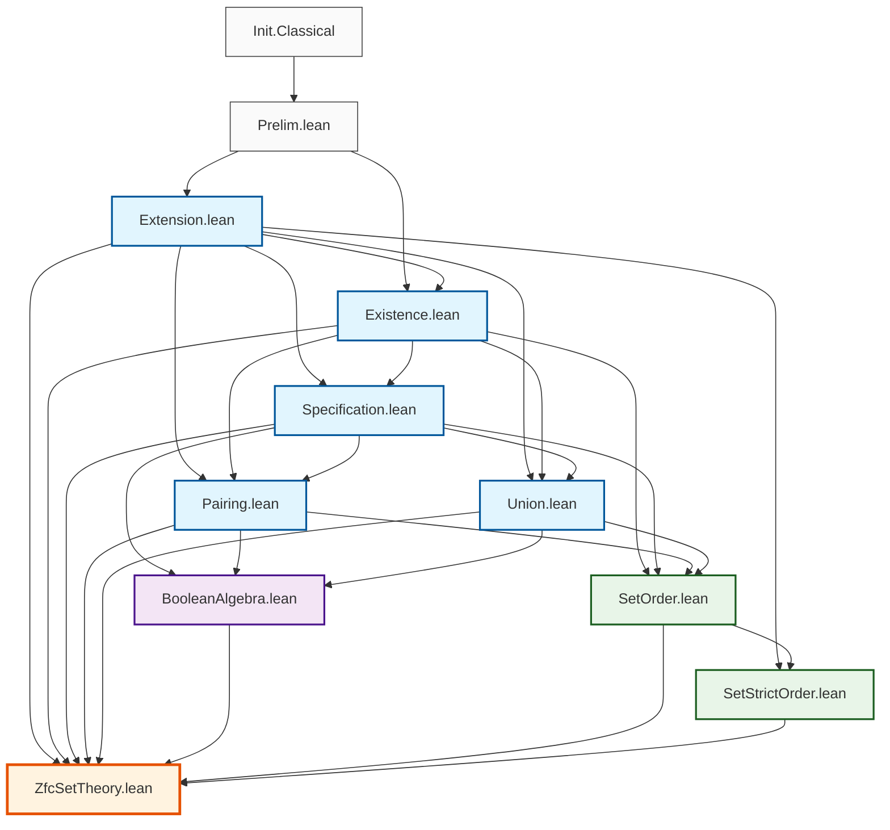

# Diagrama de Dependencias - ZfcSetTheory

## Estructura General del Proyecto

```
ZfcSetTheory/
├── Prelim.lean                 # Definiciones preliminares
├── Extension.lean              # Axioma de Extensionalidad
├── Existence.lean              # Axioma de Existencia (conjunto vacío)
├── Specification.lean          # Axioma de Especificación
├── Pairing.lean               # Axioma de Pares
├── Union.lean                 # Axioma de Unión + Unión Binaria + Diferencia Simétrica
├── BooleanAlgebra.lean        # Álgebra Booleana de conjuntos (teoremas)
├── SetOrder.lean              # Orden parcial y retículos (completo)
├── SetStrictOrder.lean        # Orden estricto (completo)
└── ZfcSetTheory.lean          # Módulo principal
```

## Diagrama de Dependencias



## Jerarquía de Espacios de Nombres

### 1. **SetUniverse** (Namespace raíz)

```lean
namespace SetUniverse
  -- Definición axiomática de pertenencia
  axiom mem (x y : U) : Prop
  notation:50 lhs:51 " ∈ " rhs:51 => mem lhs rhs
```

### 2. **SetUniverse.ExtensionAxiom**

```lean
namespace SetUniverse.ExtensionAxiom
  -- Axioma de Extensionalidad
  -- Definiciones: subseteq (⊆), subset (⊂), disjoint (⟂)
  -- Teoremas: orden parcial, igualdad de conjuntos
```

### 3. **SetUniverse.ExistenceAxiom**

```lean
namespace SetUniverse.ExistenceAxiom
  -- Axioma de Existencia del conjunto vacío
  -- Definiciones: EmptySet (∅)
  -- Teoremas: unicidad del vacío, propiedades básicas
```

### 4. **SetUniverse.SpecificationAxiom**

```lean
namespace SetUniverse.SpecificationAxiom
  -- Axioma de Especificación/Separación
  -- Definiciones: SpecSet, BinInter (∩), Difference (\)
  -- Teoremas: propiedades de intersección y diferencia
```

### 5. **SetUniverse.PairingAxiom**

```lean
namespace SetUniverse.PairingAxiom
  -- Axioma de Pares
  -- Definiciones: PairSet {a,b}, Singleton {a}, OrderedPair ⟨a,b⟩
  -- Teoremas: pares ordenados, relaciones, funciones
```

### 6. **SetUniverse.UnionAxiom**

```lean
namespace SetUniverse.UnionAxiom
  -- Axioma de Unión
  -- Definiciones: UnionSet (⋃), BinUnion (∪), SymDiff (△)
  -- Teoremas: propiedades de unión de familias y binaria
```

### 7. **SetUniverse.BooleanAlgebra**

```lean
namespace SetUniverse.BooleanAlgebra
  -- Álgebra Booleana de conjuntos
  -- Teoremas: leyes booleanas, distributividad, idempotencia
```

### 8. **SetUniverse.SetOrder**

```lean
namespace SetUniverse.SetOrder
  -- Orden parcial y estructura de retículo
  -- Definiciones: isUpperBound, isLowerBound, isSupremum, isInfimum
  -- Teoremas: propiedades de orden, cotas, supremos/ínfimos
```

### 9. **SetUniverse.SetStrictOrder**

```lean
namespace SetUniverse.SetStrictOrder
  -- Orden estricto
  -- Teoremas: irreflexividad, asimetría, transitividad
  -- Relaciones entre orden parcial y estricto
```

## Dependencias por Nivel

### **Nivel 0: Fundamentos**

- `Prelim.lean` - Definiciones básicas (ExistsUnique, etc.)

### **Nivel 1: Axiomas Básicos**

- `Extension.lean` - Axioma de Extensionalidad
- `Existence.lean` - Axioma de Existencia

### **Nivel 2: Axiomas de Construcción**

- `Specification.lean` - Construcción por especificación
- `Pairing.lean` - Construcción de pares
- `Union.lean` - Construcción de uniones + operaciones binarias

### **Nivel 3: Estructuras Algebraicas**

- `BooleanAlgebra.lean` - Teoremas booleanos
- `SetOrder.lean` - Estructura de orden y retículo
- `SetStrictOrder.lean` - Orden estricto

### **Nivel 4: Integración**

- `ZfcSetTheory.lean` - Módulo principal que exporta todo

## Exports por Módulo

### Extension.lean

```lean
export SetUniverse.ExtensionAxiom (
    ExtSet, subseteq, subset, disjoint,
    subseteq_reflexive, subseteq_transitive, subseteq_antisymmetric,
    subset_irreflexive, subset_asymmetric, subset_transitive
)
```

### Existence.lean

```lean
export SetUniverse.ExistenceAxiom (
    EmptySet, EmptySet_is_empty, EmptySet_subseteq_any
)
```

### Specification.lean

```lean
export SetUniverse.SpecificationAxiom (
    SpecSet, BinInter, Difference,
    BinInter_commutative, Difference_is_specified
)
```

### Pairing.lean

```lean
export SetUniverse.PairingAxiom (
    PairSet, Singleton, OrderedPair, fst, snd,
    isRelation, isFunction, domain, range
)
```

### Union.lean

```lean
export SetUniverse.UnionAxiom (
    UnionSet, BinUnion, SymDiff, 
    BinUnion_is_specified, SymDiff_comm
)
```

### BooleanAlgebra.lean

```lean
export SetUniverse.BooleanAlgebra (
    BinUnion_comm, BinInter_comm, 
    BinUnion_idem, BinInter_idem
)
```

### SetOrder.lean

```lean
export SetUniverse.SetOrder (
    isUpperBound, isLowerBound, isSupremum, isInfimum,
    empty_is_minimum, any_family_bounded_below
)
```

### SetStrictOrder.lean

```lean
export SetUniverse.SetStrictOrder (
    strict_order_irreflexive, strict_order_asymmetric,
    strict_order_transitive, partial_to_strict_order
)
```

## Notas de Diseño

1. **Separación de Responsabilidades**: Cada módulo maneja un aspecto específico de ZFC
2. **Dependencias Mínimas**: Solo se importa lo estrictamente necesario
3. **Exports Selectivos**: Solo se exportan las definiciones y teoremas públicos
4. **Jerarquía Clara**: Los axiomas básicos no dependen de los complejos
5. **Modularidad**: Cada namespace es independiente y reutilizable

## Comandos de Verificación

```bash
# Verificar dependencias
lean --deps ZfcSetTheory.lean

# Compilar módulo específico
lean --make ZfcSetTheory/BooleanAlgebra.lean

# Compilar todo el proyecto
lean --make ZfcSetTheory.lean
```
