# Diagrama de Dependencias - ZfcSetTheory

**Última actualización:** 7 de febrero de 2026

## Estructura General del Proyecto

```
ZfcSetTheory/
├── Prelim.lean                     # Definiciones preliminares
├── Extension.lean                  # Axioma de Extensionalidad
├── Existence.lean                  # Axioma de Existencia (conjunto vacío)
├── Specification.lean              # Axioma de Especificación
├── Pairing.lean                    # Axioma de Pares
├── Union.lean                      # Axioma de Unión + Unión Binaria + Diferencia Simétrica
├── PowerSet.lean                   # Axioma del Conjunto Potencia
├── OrderedPair.lean                # Extensiones del Par Ordenado
├── CartesianProduct.lean           # Producto Cartesiano A ×ₛ B
├── Relations.lean                  # Relaciones: equivalencia, orden, clases
├── BooleanAlgebra.lean             # Álgebra Booleana de conjuntos (teoremas)
├── PowerSetAlgebra.lean            # Álgebra del conjunto potencia (complemento, De Morgan)
├── GeneralizedDeMorgan.lean        # Leyes de De Morgan generalizadas para familias
├── GeneralizedDistributive.lean    # Leyes distributivas generalizadas
├── AtomicBooleanAlgebra.lean       # Álgebra de Boole atómica
├── SetOrder.lean                   # Orden parcial y retículos (completo)
├── SetStrictOrder.lean             # Orden estricto (completo)
├── Cardinality.lean                # Teoremas de Cantor y Cantor-Schröder-Bernstein
└── ZfcSetTheory.lean               # Módulo principal
```

## Diagrama de Dependencias

```mermaid
graph TD
    %% Nivel 0: Fundamentos
    IC[Init.Classical] --> P[Prelim.lean]
    
    %% Nivel 1: Axiomas básicos
    P --> E[Extension.lean]
    P --> Ex[Existence.lean]
    
    %% Nivel 2: Axiomas que dependen de Extension
    E --> Ex
    E --> S[Specification.lean]
    E --> Pa[Pairing.lean]
    E --> U[Union.lean]
    E --> Pot[Potencia.lean]
    
    %% Nivel 3: Axiomas que dependen de Existence
    Ex --> S
    Ex --> Pa
    Ex --> U
    Ex --> Pot
    
    %% Nivel 4: Axiomas complejos
    S --> Pa
    S --> U
    S --> Pot
    Pa --> U
    Pa --> Pot
    U --> Pot
    
    %% Nivel 5: Extensiones del Par Ordenado
    Pot --> OP[OrderedPair.lean]
    Pa --> OP
    U --> OP
    
    %% Nivel 6: Producto Cartesiano
    OP --> CP[CartesianProduct.lean]
    
    %% Nivel 7: Relaciones
    CP --> Rel[Relations.lean]
    
    %% Nivel 8: Ãlgebras y órdenes
    E --> SSO[SetStrictOrder.lean]
    Ex --> SO[SetOrder.lean]
    S --> SO
    Pa --> SO
    U --> SO
    SO --> SSO
    S --> BA[BooleanAlgebra.lean]
    Pa --> BA
    U --> BA
    
    %% Nivel 9: Cardinalidad
    Rel --> Card[Cardinality.lean]
    Pot --> Card
    
    %% Nivel 10: Módulo principal
    E --> Z[ZfcSetTheory.lean]
    Ex --> Z
    S --> Z
    Pa --> Z
    U --> Z
    Pot --> Z
    OP --> Z
    CP --> Z
    Rel --> Z
    BA --> Z
    SO --> Z
    SSO --> Z
    Card --> Z
    
    %% Estilos
    classDef axiom fill:#e1f5fe,stroke:#01579b,stroke-width:2px
    classDef algebra fill:#f3e5f5,stroke:#4a148c,stroke-width:2px
    classDef order fill:#e8f5e8,stroke:#1b5e20,stroke-width:2px
    classDef extension fill:#fff9c4,stroke:#f57f17,stroke-width:2px
    classDef relation fill:#fce4ec,stroke:#880e4f,stroke-width:2px
    classDef main fill:#fff3e0,stroke:#e65100,stroke-width:3px
    classDef external fill:#fafafa,stroke:#424242,stroke-width:1px
    
    class E,Ex,S,Pa,U,Pot axiom
    class BA algebra
    class SO,SSO order
    class OP,CP extension
    class Rel relation
    class Z main
    class IC,P external
```



## Jerarquía de Espacios de Nombres

### 1. **SetUniverse** (Namespace raíz)

```lean
namespace SetUniverse
  -- Definición axiomática de pertenencia
  axiom mem (x y : U) : Prop
  notation:50 lhs:51 " ∈ " rhs:51 => mem lhs rhs
```

### 2. **SetUniverse.ExtensionAxiom**

```lean
namespace SetUniverse.ExtensionAxiom
  -- Axioma de Extensionalidad
  -- Definiciones: subseteq (⊆), subset (⊂), disjoint (⟂)
  -- Teoremas: orden parcial, igualdad de conjuntos
```

### 3. **SetUniverse.ExistenceAxiom**

```lean
namespace SetUniverse.ExistenceAxiom
  -- Axioma de Existencia del conjunto vacío
  -- Definiciones: EmptySet (∅)
  -- Teoremas: unicidad del vacío, propiedades básicas
```

### 4. **SetUniverse.SpecificationAxiom**

```lean
namespace SetUniverse.SpecificationAxiom
  -- Axioma de Especificación/Separación
  -- Definiciones: SpecSet, BinInter (∩), Difference (\)
  -- Teoremas: propiedades de intersección y diferencia
```

### 5. **SetUniverse.PairingAxiom**

```lean
namespace SetUniverse.PairingAxiom
  -- Axioma de Pares
  -- Definiciones: PairSet {a,b}, Singleton {a}, OrderedPair ⟨a,b⟩
  -- Teoremas: pares ordenados, relaciones, funciones
```

### 6. **SetUniverse.UnionAxiom**

```lean
namespace SetUniverse.UnionAxiom
  -- Axioma de Unión
  -- Definiciones: UnionSet (⋃), BinUnion (∪), SymDiff (△)
  -- Teoremas: propiedades de unión de familias y binaria
```

### 7. **SetUniverse.PowerSetAxiom**

```lean
namespace SetUniverse.PowerSetAxiom
  -- Axioma del Conjunto Potencia
  -- Definiciones: PowerSetOf (𝒫)
  -- Teoremas: caracterización, monotonía, propiedades con ∩ y ∪
```

### 8. **SetUniverse.OrderedPairExtensions**

```lean
namespace SetUniverse.OrderedPairExtensions
  -- Extensiones del Par Ordenado
  -- Teoremas: OrderedPair_eq_of, OrderedPair_eq_iff, OrderedPair_in_PowerSet
```

### 9. **SetUniverse.CartesianProduct**

```lean
namespace SetUniverse.CartesianProduct
  -- Producto Cartesiano
  -- Definiciones: CartesianProduct (A ×ₛ B)
  -- Teoremas: caracterización, vacío, monotonía, distributividad
```

### 10. **SetUniverse.Relations**

```lean
namespace SetUniverse.Relations
  -- Relaciones sobre conjuntos
  -- Definiciones: isRelationOn, isReflexiveOn, isSymmetricOn, etc.
  -- Tipos: equivalencia, preorden, orden parcial, orden lineal, orden estricto
  -- Construcciones: EqClass, QuotientSet, IdRel, InverseRel
  -- Teoremas: propiedades de relaciones, clases de equivalencia
```

### 11. **SetUniverse.BooleanAlgebra**

```lean
namespace SetUniverse.BooleanAlgebra
  -- Álgebra Booleana de conjuntos
  -- Teoremas: leyes booleanas, distributividad, idempotencia
```

### 12. **SetUniverse.PowerSetAlgebra**

```lean
namespace SetUniverse.PowerSetAlgebra
  -- Álgebra del conjunto potencia
  -- Definiciones: Complement (X^∁[ A ]), ComplementFamily
  -- Teoremas: double_complement, DeMorgan_union_family, DeMorgan_inter_family
```

### 13. **SetUniverse.GeneralizedDeMorgan**

```lean
namespace SetUniverse.GeneralizedDeMorgan
  -- Leyes de De Morgan generalizadas
  -- Teoremas: complement_union_eq_inter_complement, complement_inter_eq_union_complement
```

### 14. **SetUniverse.GeneralizedDistributive**

```lean
namespace SetUniverse.GeneralizedDistributive
  -- Leyes distributivas generalizadas
  -- Definiciones: DistribSet
  -- Teoremas: inter_union_distrib, union_inter_distrib
```

### 15. **SetUniverse.AtomicBooleanAlgebra**

```lean
namespace SetUniverse.AtomicBooleanAlgebra
  -- Álgebra de Boole atómica
  -- Definiciones: isAtom, Atoms, isAtomic, atomBelow
  -- Teoremas: singleton_is_atom, atom_is_singleton, atom_iff_singleton
  --           PowerSet_is_atomic, element_is_union_of_atoms
```

### 16. **SetUniverse.SetOrder**

```lean
namespace SetUniverse.SetOrder
  -- Orden parcial y estructura de retículo
  -- Definiciones: isUpperBound, isLowerBound, isSupremum, isInfimum
  -- Teoremas: propiedades de orden, cotas, supremos/ínfimos
```

### 17. **SetUniverse.SetStrictOrder**

```lean
namespace SetUniverse.SetStrictOrder
  -- Orden estricto
  -- Teoremas: irreflexividad, asimetría, transitividad
  -- Relaciones entre orden parcial y estricto
```

### 18. **SetUniverse.Cardinality**

```lean
namespace SetUniverse.Cardinality
  -- Teoría de Cardinalidad
  -- Definiciones: DiagonalSet, SetDiff, singletonMap, CSB_core, CSB_bijection
  -- Teoremas de Cantor: cantor_no_surjection, cantor_no_bijection
  -- Teorema de Cantor-Schröder-Bernstein: cantor_schroeder_bernstein
```

## Dependencias por Nivel

### **Nivel 0: Fundamentos**

- `Prelim.lean` - Definiciones básicas (ExistsUnique, etc.)

### **Nivel 1: Axiomas Básicos**

- `Extension.lean` - Axioma de Extensionalidad
- `Existence.lean` - Axioma de Existencia

### **Nivel 2: Axiomas de Construcción**

- `Specification.lean` - Construcción por especificación
- `Pairing.lean` - Construcción de pares
- `Union.lean` - Construcción de uniones + operaciones binarias

### **Nivel 3: Axiomas Avanzados**

- `Potencia.lean` - Construcción de conjunto potencia

### **Nivel 4: Extensiones del Par Ordenado**

- `OrderedPair.lean` - Teoremas adicionales sobre pares ordenados

### **Nivel 5: Producto Cartesiano**

- `CartesianProduct.lean` - Producto cartesiano A ×ₛ B

### **Nivel 6: Relaciones**

- `Relations.lean` - Relaciones, equivalencias, órdenes, clases de equivalencia

### **Nivel 7: Estructuras Algebraicas**

- `BooleanAlgebra.lean` - Teoremas booleanos
- `PowerSetAlgebra.lean` - Álgebra del conjunto potencia
- `GeneralizedDeMorgan.lean` - De Morgan generalizadas
- `GeneralizedDistributive.lean` - Distributivas generalizadas
- `AtomicBooleanAlgebra.lean` - Álgebra de Boole atómica
- `SetOrder.lean` - Estructura de orden y retículo
- `SetStrictOrder.lean` - Orden estricto
- `Cardinality.lean` - Teoremas de Cantor y Cantor-Schröder-Bernstein
- `SetStrictOrder.lean` - Orden estricto

### **Nivel 8: Integración**

- `ZfcSetTheory.lean` - Módulo principal que exporta todo

## Exports por Módulo

### Extension.lean

```lean
export SetUniverse (mem)
export SetUniverse.ExtensionAxiom (
    ExtSet, subseteq, subset, disjoint,
    subseteq_reflexive, subseteq_transitive, subseteq_antisymmetric,
    subset_irreflexive, subset_asymmetric, subset_transitive
)
```

### Existence.lean

```lean
export SetUniverse.ExistenceAxiom (
    ExistsAnEmptySet, ExistsUniqueEmptySet, EmptySet,
    EmptySet_is_empty, EmptySet_is_same, EmptySet_subseteq_any
)
```

### Specification.lean

```lean
export SetUniverse.SpecificationAxiom (
    Specification, SpecSet, SpecSet_is_specified,
    BinInter, BinInter_is_specified, BinInter_commutative,
    BinInter_associative, BinInter_absorbent_elem, BinInter_idempotent,
    BinInter_with_subseteq_full,
    Difference, Difference_is_specified, Difference_with_self,
    Difference_empty_right, Difference_empty_left
)
```

### Pairing.lean

```lean
export SetUniverse.PairingAxiom (
    Pairing, PairingUniqueSet, PairSet, PairSet_is_specified,
    Singleton, Singleton_is_specified, nonempty_iff_exists_mem,
    member_inter, interSet, interSet_of_singleton,
    OrderedPair, OrderedPair_is_specified, isOrderedPair,
    fst, snd, fst_of_ordered_pair, snd_of_ordered_pair,
    OrderedPairSet_is_WellConstructed,
    isRelation, isRelation_in_Sets, domain, range,
    isReflexive, isIReflexive, isSymmetric, isAsymmetric,
    isAntiSymmetric, isTransitive,
    isEquivalenceRelation, isEquivalenceRelation_in_Set,
    Eq_of_OrderedPairs, OrderedPairsComp_eq, Eq_of_OrderedPairs_given_projections,
    pair_set_eq_singleton, ordered_pair_self_eq_singleton_singleton,
    isFunction, isTotalFunction, isInyective, isSurjectiveFunction, isBijectiveFunction
)
```

### Union.lean

```lean
export SetUniverse.UnionAxiom (
  Union, UnionExistsUnique, Union_is_specified,
  UnionSet, UnionSet_is_empty, UnionSet_is_empty',
  UnionSet_is_specified, UnionSet_is_unique,
  Set_is_empty_1, Set_is_empty_2, Set_is_empty_3,
  UnionSetIsEmpty_SetNonEmpty_SingletonEmptySet,
  BinUnion, BinUnion_is_specified, BinUnion_comm,
  BinUnion_empty_left, BinUnion_empty_right, BinUnion_idem, BinUnion_assoc,
  BinUnion_absorb_inter,
  SymDiff, SymDiff_is_specified, SymDiff_comm, SymDiff_empty_left, SymDiff_self
)
```

### Potencia.lean

```lean
export SetUniverse.PowerSetAxiom (
  PowerSet, PowerSetExistsUnique, PowerSetOf,
  PowerSet_is_specified, PowerSet_is_unique,
  empty_mem_PowerSet, self_mem_PowerSet, PowerSet_nonempty, PowerSet_empty,
  PowerSet_mono, PowerSet_mono_iff, PowerSet_inter,
  PowerSet_union_subset, subset_PowerSet_Union, Union_PowerSet
)
```

### OrderedPair.lean

```lean
export SetUniverse.OrderedPairExtensions (
  OrderedPair_eq_of, OrderedPair_eq_iff, OrderedPair_in_PowerSet
)
```

### CartesianProduct.lean

```lean
export SetUniverse.CartesianProduct (
  CartesianProduct,
  CartesianProduct_is_specified,
  OrderedPair_mem_CartesianProduct,
  CartesianProduct_empty_left,
  CartesianProduct_empty_right,
  CartesianProduct_mono,
  CartesianProduct_distrib_union_left,
  CartesianProduct_distrib_union_right,
  CartesianProduct_distrib_inter_left,
  CartesianProduct_distrib_inter_right
)
```

### Relations.lean

```lean
export SetUniverse.Relations (
    isRelationOn, isRelationFrom, Related,
    isReflexiveOn, isIrreflexiveOn, isSymmetricOn, isAntiSymmetricOn, isAsymmetricOn,
    isTransitiveOn, isConnectedOn, isStronglyConnectedOn, isTrichotomousOn,
    isEquivalenceOn, isPreorderOn, isPartialOrderOn, isLinearOrderOn,
    isStrictOrderOn, isStrictPartialOrderOn, isStrictLinearOrderOn,
    isWellFoundedOn, isWellOrderOn,
    EqClass, QuotientSet, IdRel, InverseRel,
    Asymmetric_implies_Irreflexive, StrictOrder_is_Irreflexive,
    StrictPartialOrder_is_Irreflexive, Irreflexive_Transitive_implies_Asymmetric,
    Asymmetric_iff_Irreflexive_and_AntiSymmetric,
    PartialOrder_Connected_is_LinearOrder, LinearOrder_comparable,
    mem_IdRel, IdRel_is_Equivalence, mem_EqClass, EqClass_mem_self,
    mem_EqClass_of_Related, Related_of_mem_EqClass, mem_EqClass_iff,
    EqClass_eq_iff, EqClass_eq_or_disjoint
)
```

### BooleanAlgebra.lean

```lean
export SetUniverse.BooleanAlgebra (
    BinUnion_comm_ba, BinUnion_empty_left_ba, BinUnion_empty_right_ba,
    BinUnion_idem_ba, BinInter_idem_ba, BinInter_empty,
    BinInter_comm_ba, Subseteq_trans_ba, Subseteq_reflexive_ba,
    Union_monotone, Inter_monotone, Subseteq_inter_eq, Diff_self, Diff_empty
)
```

### SetOrder.lean

```lean
export SetUniverse.SetOrder (
    isUpperBound, isLowerBound, isSupremum, isInfimum,
    empty_is_minimum, any_family_bounded_below,
    inter_is_glb, union_is_lub,
    union_monotone_left, union_monotone_right,
    inter_monotone_left, inter_monotone_right
)
```

### SetStrictOrder.lean

```lean
export SetUniverse.SetStrictOrder (
    strict_order_irreflexive, strict_order_asymmetric,
    strict_order_transitive, partial_to_strict_order
)
```

### Cardinality.lean

```lean
export SetUniverse.Cardinality (
    -- Teorema de Cantor
    DiagonalSet, DiagonalSet_is_specified, DiagonalSet_not_in_range,
    cantor_no_surjection, cantor_no_bijection,
    singletonMap, singletonMap_is_specified, singletonMap_is_function,
    singletonMap_is_injective, cantor_strict_dominance, cantor_not_equipotent,
    -- Teorema de Cantor-Schröder-Bernstein
    SetDiff, SetDiff_is_specified, isCSB_closed, CSB_core, CSB_core_is_specified,
    CSB_bijection, CSB_bijection_is_specified, CSB_bijection_is_bijection,
    cantor_schroeder_bernstein
)
```

## Notas de Diseño

1. **Separación de Responsabilidades**: Cada módulo maneja un aspecto específico de ZFC
2. **Dependencias Mínimas**: Solo se importa lo estrictamente necesario
3. **Exports Selectivos**: Solo se exportan las definiciones y teoremas públicos
4. **Jerarquía Clara**: Los axiomas básicos no dependen de los complejos
5. **Modularidad**: Cada namespace es independiente y reutilizable
6. **Sin Mathlib**: El proyecto no depende de Mathlib, solo de `Init.Classical`

## Comandos de Verificación

```bash
# Compilar todo el proyecto
lake build

# Ver errores de compilación
lake build 2>&1

# Limpiar y recompilar
lake clean && lake build
```
