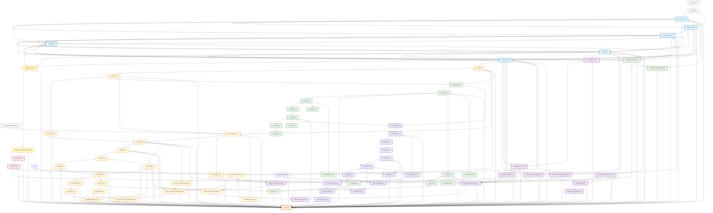

# Diagrama de Dependencias - ZfcSetTheory

**Última actualización:** 2026-04-29
**Autor**: Julián Calderón Almendros

> **Nota (Fase 3, 2026-04-02):** Los identificadores del proyecto han sido renombrados según convenciones Mathlib. Los nombres en las secciones "Exports por Módulo" pueden reflejar nombres anteriores; consultar REFERENCE.md §0 para la tabla completa de renombramientos.

## Estructura General del Proyecto

```text
ZfcSetTheory/
├── ZFC.lean                             # Módulo raíz (exporta todo)
├── lakefile.lean
├── lean-toolchain                       # Lean v4.29.0
└── ZFC/
    ├── Axiom/
    │   ├── Extension.lean               # Axioma de Extensionalidad
    │   ├── Existence.lean               # Axioma de Existencia (conjunto vacío)
    │   ├── Specification.lean           # Axioma de Especificación (sep, inter, sdiff)
    │   ├── Pairing.lean                 # Axioma de Pares
    │   ├── Union.lean                   # Axioma de Unión + union (∪) + symmDiff (△)
    │   ├── PowerSet.lean                # Axioma del Conjunto Potencia
    │   └── Infinity.lean                # Axioma del Infinito y conjunto ω
    ├── Core/
    │   └── Prelim.lean                  # ExistsUnique, infraestructura básica
    ├── SetOps/
    │   ├── OrderedPair.lean             # Par de Kuratowski, fst, snd
    │   ├── CartesianProduct.lean        # A ×ₛ B, pertenencia, proyecciones
    │   ├── Relations.lean               # Equivalencia, orden, clases de equivalencia
    │   ├── Functions.lean               # Funciones, inyectivas, biyectivas
    │   ├── FiniteSets.lean              # isFiniteSet, equipotencia refl/symm/trans
    │   ├── SetOrder.lean                # Órdenes parciales, retículos
    │   └── SetStrictOrder.lean          # Órdenes estrictos
    ├── Induction/
    │   └── Recursion.lean               # Teorema de Recursión sobre ω
    ├── Nat/
    │   ├── Basic.lean                   # IsNat, succ, pred, ω
    │   ├── Add.lean                     # Suma vía RecursiveFn + puente Peano
    │   ├── Mul.lean                     # Multiplicación vía RecursiveFn + puente Peano
    │   ├── Sub.lean                     # Sustracción saturada (monus)
    │   ├── Div.lean                     # División euclídea Patrón B
    │   ├── Pow.lean                     # Potenciación vía RecursiveFn
    │   ├── Arith.lean                   # Divisibilidad, GCD/LCM, Bézout (ZFC-nativo)
    │   ├── Factorial.lean               # Factorial Patrón B
    │   ├── Gcd.lean                     # GCD/LCM ZFC-nativo (algoritmo euclídeo)
    │   ├── Primes.lean                  # isPrime ZFC-nativo, TFA
    │   ├── Binom.lean                   # Coeficientes binomiales Patrón B
    │   ├── MaxMin.lean                  # maxOf/minOf Patrón B, 31 teoremas
    │   ├── NewtonBinom.lean             # Teorema binomial de Newton Patrón B
    │   └── WellFounded.lean             # Buen fundamento de ω
    ├── Peano/
    │   ├── Import.lean                  # Isomorfismo Von Neumann ↔ Peano
    │   ├── FiniteSequences.lean         # isFinSeq, FinSeqSet, appendElem
    │   ├── FiniteSequencesArith.lean    # seqSum, seqProd, familyProduct
    │   └── FiniteSequencesBridge.lean   # nth, dlistToSeq, TFA nativo
    ├── BoolAlg/
    │   ├── Basic.lean                   # Álgebra Booleana de conjuntos
    │   ├── Ring.lean                    # Anillo Booleano con symmDiff
    │   ├── PowerSetAlgebra.lean         # Álgebra del conjunto potencia
    │   ├── GenDeMorgan.lean             # De Morgan generalizadas para familias
    │   ├── GenDistributive.lean         # Distributividad generalizada
    │   ├── Atomic.lean                  # Átomos, atomicidad, 𝒫(A) atómica
    │   ├── Complete.lean                # 𝒫(A) retículo completo + BA completa atómica
    │   ├── FiniteCofinite.lean          # FinCofAlg(ω), contraejemplo no completa
    │   ├── Representation.lean          # Teorema de Stone: BA completa atómica ≅ 𝒫(A)
    │   ├── FiniteBA.lean               # |BA finita| = 2^n
    │   └── BoolRingBA.lean             # Correspondencia Anillo Booleano ↔ BA
    ├── Cardinal/
    │   ├── Basic.lean                   # Cantor, Cantor-Schröder-Bernstein
    │   └── FinitePowerSet.lean          # |𝒫(F)| = 2^n para F finito
    ├── Int/
    │   ├── Equiv.lean                   # IntEquivRel en ω×ω
    │   ├── Basic.lean                   # IntSet, intClass, zeroZ, oneZ
    │   ├── Add.lean                     # addZ, grupo abeliano
    │   ├── Neg.lean                     # negZ, subZ, inversos aditivos
    │   ├── Mul.lean                     # mulZ, anillo conmutativo
    │   ├── Ring.lean                    # Distributividad, dominio de integridad
    │   ├── Sub.lean                     # Propiedades derivadas de subZ
    │   ├── Pow.lean                     # powZ, leyes de exponentes
    │   ├── Order.lean                   # leZ, ltZ, orden total
    │   ├── DivMod.lean                  # dividesZ, divisibilidad
    │   ├── Embedding.lean               # natToInt : ω ↪ ℤ, zigzag ℤ ≃ ω
    │   ├── Abs.lean                     # absZ, signZ, desigualdad triangular
    │   ├── Div.lean                     # gcdZ, modZ, bezoutZ, tfa_Z
    │   ├── Induction.lean               # Inducción en ℤ por |·|, descenso
    │   ├── Units.lean                   # isUnitZ, unitZ_iff (unidades = {±1})
    │   └── MaxMin.lean                  # maxZ, minZ, 18 teoremas de retículo
    └── Rat/
        ├── Equiv.lean                   # RatEquivRel en ℤ×ℤ*
        ├── Basic.lean                   # RatSet, ratClass, zeroQ, oneQ
        ├── Add.lean                     # addQ, grupo abeliano
        ├── Neg.lean                     # negQ, subQ, inverso aditivo
        ├── Mul.lean                     # mulQ, invQ, divQ, cuerpo
        ├── Order.lean                   # leQ, ltQ, orden total, densidad
        ├── Abs.lean                     # absQ, signQ, desigualdad triangular
        ├── Embedding.lean               # intToRat : ℤ ↪ ℚ, archQ
        ├── Field.lean                   # Axiomas de cuerpo ordenado
        ├── MaxMin.lean                  # maxQ, minQ, 18 teoremas de retículo
        ├── Sequences.lean               # IsSeqQ, constSeqQ, addSeqQ, negSeqQ, mulSeqQ
        ├── Convergence.lean             # convergesToQ, limit_unique, subseq_convergent
        ├── CauchyQ.lean                 # IsCauchyQ, cauchy_bounded
        └── Monotone.lean                # nondecreasing/nonincreasing_bounded_isCauchy
```

## Diagrama de Dependencias


```mermaid
graph TD
    %% Nivel 0: Fundamentos
    IC[Init.Classical] --> P[Prelim.lean]
    
    %% Nivel 1: Axiomas básicos
    P --> E[Extension.lean]
    P --> Ex[Existence.lean]
    
    %% Nivel 2: Axiomas que dependen de Extension
    E --> Ex
    E --> S[Specification.lean]
    E --> Pa[Pairing.lean]
    E --> U[Union.lean]
    E --> Pot[PowerSet.lean]
    
    %% Nivel 3: Axiomas que dependen de Existence
    Ex --> S
    Ex --> Pa
    Ex --> U
    Ex --> Pot
    
    %% Nivel 4: Axiomas complejos
    S --> Pa
    S --> U
    S --> Pot
    Pa --> U
    Pa --> Pot
    U --> Pot
    
    %% Nivel 5: Extensiones del Par Ordenado
    Pot --> OP[OrderedPair.lean]
    Pa --> OP
    U --> OP
    
    %% Nivel 6: Producto Cartesiano
    OP --> CP[SetOps.CartesianProduct.lean]
    
    %% Nivel 7: Relaciones y Funciones
    CP --> Rel[Relations.lean]
    Rel --> Func[Functions.lean]
    
    %% Nivel 8: Números Naturales
    Pot --> Inf[Infinity.lean]
    Inf --> Nat[Nat.Basic.lean]
    Nat --> Rec[Recursion.lean]
    Nat --> PI[PeanoImport.lean]
    Inf --> PI
    PL[peanolib/PeanoNatAxioms] --> PI
    PI --> NA[Nat.Add.lean]
    Rec --> NA
    NA --> NM[Nat.Mul.lean]
    NM --> NS[Nat.Sub.lean]
    NS --> ND[Nat.Div.lean]
    NM --> NP[Nat.Pow.lean]
    ND --> NAR[Nat.Arith.lean]
    NP --> NAR
    NAR --> NF[Nat.Factorial.lean]
    NAR --> NG[Nat.Gcd.lean]
    NG --> NPR[Nat.Primes.lean]
    NF --> NB[Nat.Binom.lean]
    NB --> NNB[Nat.NewtonBinom.lean]
    NP --> NNB
    PI --> NMM[Nat.MaxMin.lean]
    PI --> NWF[Nat.WellFounded.lean]
    NA --> FSeq[Peano.FiniteSequences.lean]
    NN --> FSets[SetOps.FiniteSets.lean]
    Inf --> FSets
    NM --> FSA[Peano.FiniteSequencesArith.lean]
    FSeq --> FSA
    FSets --> FSA
    FSA --> FSB[Peano.FiniteSequencesBridge.lean]
    NPR --> FSB

    %% Nivel 9: Álgebras y órdenes
    E --> SSO[SetOps.SetStrictOrder.lean]
    Ex --> SO[SetOps.SetOrder.lean]
    S --> SO
    Pa --> SO
    U --> SO
    SO --> SSO
    S --> BA[BoolAlg.Basic.lean]
    Pa --> BA
    U --> BA
    Pot --> PSA[BoolAlg.PowerSetAlgebra.lean]
    S --> PSA
    PSA --> BR[BoolAlg.Ring.lean]
    U --> BR
    BA --> ABA[BoolAlg.Atomic.lean]
    Pot --> ABA
    ABA --> CBA[BoolAlg.Complete.lean]
    Pot --> CBA
    CBA --> FC[BoolAlg.FiniteCofinite.lean]
    FSets --> FC
    NA --> FC
    Card --> FC
    CBA --> Rep[BoolAlg.Representation.lean]
    ABA --> Rep
    Card --> Rep
    Func --> Rep
    PSA --> Rep
    GDM --> Rep
    GDD --> Rep
    SO --> Rep
    BR --> BRB[BoolAlg.BoolRingBA.lean]
    FSets --> FPS[Cardinal.FinitePowerSet.lean]
    NP --> FPS
    FC --> FPS
    FPS --> FBA[BoolAlg.FiniteBA.lean]
    Rep --> FBA
    U --> GDM[BoolAlg.GenDeMorgan.lean]
    Pot --> GDM
    U --> GDD[BoolAlg.GenDistributive.lean]
    Pot --> GDD
    
    %% Nivel 10: Cardinalidad
    Func --> Card[Cardinal.Basic.lean]
    Pot --> Card
    
    %% Nivel 12: Enteros ℤ (Phase 5)
    Nat --> IE[Int/Equiv.lean]
    Inf --> IE
    IE --> IB[Int/Basic.lean]
    IB --> IA[Int/Add.lean]
    IA --> IN[Int/Neg.lean]
    IN --> IM[Int/Mul.lean]
    IM --> IR[Int/Ring.lean]
    IM --> IPo[Int/Pow.lean]
    IA --> ISub[Int/Sub.lean]
    IB --> IDM[Int/DivMod.lean]
    IB --> IO[Int/Order.lean]
    IA --> IEmb[Int/Embedding.lean]
    IO --> IAbs[Int/Abs.lean]
    IAbs --> IDiv[Int/Div.lean]
    IDM --> IDiv
    NG --> IDiv
    IB --> IInd[Int/Induction.lean]
    IR --> IU[Int/Units.lean]
    IO --> IMM[Int/MaxMin.lean]

    %% Nivel 13: Racionales ℚ (Phase 6)
    IE --> RE[Rat/Equiv.lean]
    IM --> RE
    RE --> RB[Rat/Basic.lean]
    RB --> RA[Rat/Add.lean]
    RA --> RN[Rat/Neg.lean]
    RN --> RM[Rat/Mul.lean]
    RM --> RO[Rat/Order.lean]
    RO --> RAbs[Rat/Abs.lean]
    RAbs --> REmb[Rat/Embedding.lean]
    IInd --> REmb
    IEmb --> REmb
    RM --> RF[Rat/Field.lean]
    RO --> RF
    RO --> RMM[Rat/MaxMin.lean]

    %% Nivel 14: Sucesiones en ℚ (Phase 6.5)
    RB --> RS[Rat/Sequences.lean]
    RAbs --> RC[Rat/Convergence.lean]
    RS --> RC
    NMM --> RC
    RC --> RMM
    RMM --> RC
    RC --> RCQ[Rat/CauchyQ.lean]
    RCQ --> RMon[Rat/Monotone.lean]

    %% Nivel 11: Módulo principal
    E --> Z[ZFC.lean]
    Ex --> Z
    S --> Z
    Pa --> Z
    U --> Z
    Pot --> Z
    OP --> Z
    CP --> Z
    Rel --> Z
    Func --> Z
    Inf --> Z
    Nat --> Z
    Rec --> Z
    BA --> Z
    PSA --> Z
    BR --> Z
    ABA --> Z
    CBA --> Z
    FC --> Z
    GDM --> Z
    GDD --> Z
    SO --> Z
    SSO --> Z
    Card --> Z
    PI --> Z
    NA --> Z
    NM --> Z
    NS --> Z
    ND --> Z
    NP --> Z
    NAR --> Z
    NF --> Z
    NG --> Z
    NPR --> Z
    NB --> Z
    NMM --> Z
    NNB --> Z
    NWF --> Z
    FSeq --> Z
    FSets --> Z
    FSA --> Z
    FSB --> Z
    Rep --> Z
    FBA --> Z
    BRB --> Z
    FPS --> Z
    IB --> Z
    IM --> Z
    IO --> Z
    IDiv --> Z
    RB --> Z
    RM --> Z
    RO --> Z
    RF --> Z
    RC --> Z
    RCQ --> Z
    RMon --> Z

    %% Estilos
    classDef axiom fill:#e1f5fe,stroke:#01579b,stroke-width:2px
    classDef algebra fill:#f3e5f5,stroke:#4a148c,stroke-width:2px
    classDef order fill:#e8f5e8,stroke:#1b5e20,stroke-width:2px
    classDef extension fill:#fff9c4,stroke:#f57f17,stroke-width:2px
    classDef relation fill:#fce4ec,stroke:#880e4f,stroke-width:2px
    classDef functions fill:#e3f2fd,stroke:#0d47a1,stroke-width:2px
    classDef natural fill:#fff8e1,stroke:#f57c00,stroke-width:2px
    classDef integer fill:#e8f5e9,stroke:#2e7d32,stroke-width:2px
    classDef rational fill:#ede7f6,stroke:#4527a0,stroke-width:2px
    classDef main fill:#fff3e0,stroke:#e65100,stroke-width:3px
    classDef external fill:#fafafa,stroke:#424242,stroke-width:1px

    class E,Ex,S,Pa,U,Pot axiom
    class BA,PSA,BR,ABA,CBA,FC,GDM,GDD,Rep,FBA,BRB algebra
    class SO,SSO order
    class OP,CP extension
    class Rel,Func relation
    class Inf,Nat,Rec,PI,NA,NM,NS,ND,NP,NAR,NF,NG,NPR,NB,NMM,NNB,NWF,FSeq,FSets,FSA,FSB,FPS natural
    class IE,IB,IA,IN,IM,IR,IPo,ISub,IDM,IO,IEmb,IAbs,IDiv,IInd,IU,IMM integer
    class RE,RB,RA,RN,RM,RO,RAbs,REmb,RF,RMM,RS,RC,RCQ,RMon rational
    class Z main
    class IC,P,PL external
```

## Jerarquía de Espacios de Nombres

### 1. **ZFC** (Namespace raíz)

```lean
namespace ZFC
  -- Definición axiomática de pertenencia
  axiom mem (x y : U) : Prop
  notation:50 lhs:51 " ∈ " rhs:51 => mem lhs rhs
```

### 2. **ZFC.Axiom.Extension**

```lean
namespace ZFC.Axiom.Extension
  -- Axioma de Extensionalidad
  -- Definiciones: subseteq (⊆), subset (⊂), disjoint (⟂)
  -- Teoremas: orden parcial, igualdad de conjuntos
```

### 3. **ZFC.Axiom.Existence**

```lean
namespace ZFC.Axiom.Existence
  -- Axioma de Existencia del conjunto vacío
  -- Definiciones: EmptySet (∅)
  -- Teoremas: unicidad del vacío, propiedades básicas
```

### 4. **ZFC.Axiom.Specification**

```lean
namespace ZFC.Axiom.Specification
  -- Axioma de Especificación/Separación
  -- Definiciones: sep, inter (∩), sdiff (\)
  -- Teoremas: propiedades de intersección y diferencia
```

### 5. **ZFC.Axiom.Pairing**

```lean
namespace ZFC.Axiom.Pairing
  -- Axioma de Pares
  -- Definiciones: PairSet {a,b}, Singleton {a}, OrderedPair ⟨a,b⟩
  -- Teoremas: pares ordenados, relaciones, funciones
```

### 6. **ZFC.Axiom.Union**

```lean
namespace ZFC.Axiom.Union
  -- Axioma de Unión
  -- Definiciones: sUnion (⋃), union (∪), symmDiff (△)
  -- Teoremas: propiedades de unión de familias y binaria
```

### 7. **ZFC.Axiom.PowerSet**

```lean
namespace ZFC.Axiom.PowerSet
  -- Axioma del Conjunto Potencia
  -- Definiciones: powerset (𝒫)
  -- Teoremas: caracterización, monotonía, propiedades con ∩ y ∪
```

### 8. **ZFC.SetOps.OrderedPair**

```lean
namespace ZFC.SetOps.OrderedPair
  -- Extensiones del Par Ordenado
  -- Teoremas: OrderedPair_eq_of, OrderedPair_eq_iff, OrderedPair_in_PowerSet
```

### 9. **ZFC.SetOps.CartesianProduct**

```lean
namespace ZFC.SetOps.CartesianProduct
  -- Producto Cartesiano
  -- Definiciones: SetOps.CartesianProduct (A ×ₛ B)
  -- Teoremas: caracterización, vacío, monotonía, distributividad
```

### 10. **ZFC.SetOps.Relations**

```lean
namespace ZFC.SetOps.Relations
  -- Relaciones sobre conjuntos
  -- Definiciones: isRelationOn, isReflexiveOn, isSymmetricOn, etc.
  -- Tipos: equivalencia, preorden, orden parcial, orden lineal, orden estricto
  -- Construcciones: EqClass, QuotientSet, IdRel, InverseRel
  -- Operadores: domain, range, imag (dominio y rango de relaciones)
  -- Teoremas: propiedades de relaciones, clases de equivalencia, dominio y rango
```

### 11. **ZFC.SetOps.Functions**

```lean
namespace ZFC.SetOps.Functions
  -- Funciones y aplicaciones
  -- Definiciones: isFunctionFromTo, apply (⦅⦆), composition, inverse
  -- Teoremas: propiedades de funciones, composición, aplicación
```

### 12. **ZFC.Axiom.Infinity**

```lean
namespace ZFC.Axiom.Infinity
  -- Axioma del Infinito
  -- Definiciones: isInductive, InfSet (conjunto infinito)
  -- Teoremas: existencia de conjunto inductivo infinito
```

### 13. **ZFC.Nat.Basic**

```lean
namespace ZFC.Nat.Basic
  -- Números naturales como ordinales de von Neumann
  -- Definiciones: IsNat, ℕ (conjunto omega), succ
  -- Teoremas: propiedades de números naturales, inducción
```

### 14. **ZFC.Nat.Add**

```lean
namespace ZFC.Nat.Add
  -- Suma de naturales de von Neumann vía Recursión
  -- Definiciones: successorFn, addFn, add
  -- Teoremas: semianillo conmutativo (add_zero, zero_add, add_succ, add_comm, add_assoc,
  --           add_left_cancel, add_right_cancel, add_pos_left, add_pos_right,
  --           add_lt_of_lt, add_le_left, add_le_right, fromPeano_add)
  -- Depende de: PeanoImport, Recursion
```

### 14b. **ZFC.Nat.Mul**

```lean
namespace ZFC.Nat.Mul
  -- Multiplicación de naturales de von Neumann vía Recursión
  -- Definiciones: mulFn, mul
  -- Teoremas: anillo conmutativo (mul_zero, zero_mul, mul_succ, mul_comm,
  --           mul_assoc, mul_one, one_mul, mul_ldistr, mul_rdistr, fromPeano_mul)
  -- Depende de: Nat.Add, PeanoImport, Recursion
```

### 15. **ZFC.Induction.Recursion**

```lean
namespace ZFC.Induction.Recursion
  -- Teorema de Recursión sobre ℕ
  -- Teoremas: recursión, unicidad de funciones recursivas
```

### 15. **ZFC.BoolAlg.Basic**

```lean
namespace ZFC.BoolAlg.Basic
  -- Álgebra Booleana de conjuntos
  -- Teoremas: leyes booleanas, distributividad, idempotencia
```

### 16. **ZFC.BoolAlg.PowerSetAlgebra**

```lean
namespace ZFC.BoolAlg.PowerSetAlgebra
  -- Álgebra del conjunto potencia
  -- Definiciones: Complement (X^∁[ A ]), ComplementFamily
  -- Teoremas: compl_compl, compl_union_family, compl_inter_family
```

### 17. **ZFC.BoolAlg.Ring**

```lean
namespace ZFC.BoolAlg.Ring
  -- Anillo Booleano con SymDiff
  -- Teoremas: SymDiff como suma, intersección como producto
  --           asociatividad, distributividad, conmutatividad
```

### 18. **ZFC.BoolAlg.GenDeMorgan**

```lean
namespace ZFC.BoolAlg.GenDeMorgan
  -- Leyes de De Morgan generalizadas
  -- Teoremas: complement_union_eq_inter_complement, complement_inter_eq_union_complement
```

### 19. **ZFC.BoolAlg.GenDistributive**

```lean
namespace ZFC.BoolAlg.GenDistributive
  -- Leyes distributivas generalizadas
  -- Definiciones: DistribSet
  -- Teoremas: inter_union_distrib, union_inter_distrib
```

### 20. **ZFC.BoolAlg.Atomic**

```lean
namespace ZFC.BoolAlg.Atomic
  -- Álgebra de Boole atómica
  -- Definiciones: isAtom, Atoms, isAtomic, atomBelow
  -- Teoremas: singleton_is_atom, atom_is_singleton, atom_iff_singleton
  --           PowerSet_is_atomic, element_is_union_of_atoms
```

### 20b. **ZFC.BoolAlg.Representation**

```lean
namespace ZFC.BoolAlg.Representation
  -- Teorema de representación de Stone (forma concreta)
  -- Definiciones: atomsSingletonMap, atomsBelow, atomsBelowMap
  -- Teoremas: atomsSingletonMap_is_bijection, A_equipotent_Atoms,
  --           atomsBelowMap_is_bijection, representation_equipotent,
  --           atomsBelowMap_preserves_union/inter/complement,
  --           representation_theorem (BA completa atómica ≅ 𝒫(A))
  -- Depende de: BoolAlg.Complete, BoolAlg.Atomic, Cardinal.Basic, SetOps.Functions
```

### 20c. **ZFC.BoolAlg.FiniteBA**

```lean
namespace ZFC.BoolAlg.FiniteBA
  -- Toda BA finita tiene cardinalidad 2^n
  -- Teoremas: atoms_equipotent_base, finite_atoms_of_finite, finite_of_finite_atoms,
  --           BA_cardinality_via_atoms, finite_powerset_is_finite,
  --           finite_BA_cardinality (MAIN), finite_BA_cardinality_atoms,
  --           finite_complete_atomic_BA
  -- Depende de: Cardinal.FinitePowerSet, BoolAlg.Representation
```

### 20d. **ZFC.BoolAlg.BoolRingBA**

```lean
namespace ZFC.BoolAlg.BoolRingBA
  -- Correspondencia formal Anillo Booleano ↔ Álgebra Booleana sobre 𝒫(A)
  -- Teoremas: ring_join_eq_union, ring_compl_eq_complement, BA_symmDiff_eq_ring_add,
  --           BA_ring_BA_join/complement/meet, ring_BA_ring_add/mul (round-trips),
  --           symmDiff_via_complement, ring_char_two, ring_idempotent,
  --           complement_involution, ring_add_complement_eq_universe
  -- Depende de: BoolAlg.Ring
```

### 21. **ZFC.SetOps.SetOrder**

```lean
namespace ZFC.SetOps.SetOrder
  -- Orden parcial y estructura de retículo
  -- Definiciones: isUpperBound, isLowerBound, isSupremum, isInfimum
  -- Teoremas: propiedades de orden, cotas, supremos/ínfimos
```

### 22. **ZFC.SetOps.SetStrictOrder**

```lean
namespace ZFC.SetOps.SetStrictOrder
  -- Orden estricto
  -- Teoremas: irreflexividad, asimetría, transitividad
  -- Relaciones entre orden parcial y estricto
```

### 23. **ZFC.Cardinal.Basic**

```lean
namespace ZFC.Cardinal.Basic
  -- Teoría de Cardinalidad
  -- Definiciones: DiagonalSet, SetDiff, singletonMap, CSB_core, CSB_bijection
  -- Teoremas de Cantor: cantor_no_surjection, cantor_no_bijection
  -- Teorema de Cantor-Schröder-Bernstein: cantor_schroeder_bernstein
```

### 23b. **ZFC.Cardinal.FinitePowerSet**

```lean
namespace ZFC.Cardinal.FinitePowerSet
  -- Cardinalidad del conjunto potencia finito
  -- Definiciones: removeElemMap
  -- Teoremas: equipotent_union_singleton, disjoint_union_equipotent,
  --           powerset_without_elem, powerset_halves_disjoint/union,
  --           removeElemMap_is_bijection, powerset_cardinality (|𝒫(F)| = 2^n)
  -- Depende de: SetOps.FiniteSets, Nat.Pow, BoolAlg.FiniteCofinite
```

### 24. **ZFC.Peano.FiniteSequencesArith**

```lean
namespace ZFC.Peano.FiniteSequencesArith
  -- Aritmética de secuencias finitas en ZFC
  -- Definiciones: sumStepFn, seqSumFn, seqSum, prodStepFn, seqProdFn, seqProd, familyProduct
  -- Teoremas: seqSum_zero/succ/singleton, seqProd_zero/succ/singleton
  --           familyProduct_zero, familyProduct_succ_char
  --           card_product_two, card_familyProduct
  -- Depende de: Nat.Mul, Peano.FiniteSequences, SetOps.FiniteSets
```

### 25. **ZFC.Peano.FiniteSequencesBridge**

```lean
namespace ZFC.Peano.FiniteSequencesBridge
  -- Puente DList ℕ₀ ↔ ZFC secuencias finitas + TFA nativo
  -- Definiciones: nth, dlistToSeq, dlistLen, isPrimeSeq
  -- Teoremas: nth_apply, nth_in_codomain, nth_ext, seqProd general recursion/extensionality
  --           dlistToSeq_isFinSeq, dlistToSeq_apply, dlistToSeq_seqProd
  --           isPrimeSeq, tfa_exists_native, tfa_unique_native
  -- Depende de: Peano.FiniteSequencesArith, Nat.Primes
```

## Dependencias por Nivel

### **Nivel 0: Fundamentos**

- `Prelim.lean` - Definiciones básicas (ExistsUnique, etc.)

### **Nivel 1: Axiomas Básicos**

- `Extension.lean` - Axioma de Extensionalidad
- `Existence.lean` - Axioma de Existencia

### **Nivel 2: Axiomas de Construcción**

- `Specification.lean` - Construcción por especificación
- `Pairing.lean` - Construcción de pares
- `Union.lean` - Construcción de uniones + operaciones binarias

### **Nivel 3: Axiomas Avanzados**

- `PowerSet.lean` - Construcción de conjunto potencia

### **Nivel 4: Extensiones del Par Ordenado**

- `OrderedPair.lean` - Teoremas adicionales sobre pares ordenados

### **Nivel 5: Producto Cartesiano**

- `SetOps.CartesianProduct.lean` - Producto cartesiano A ×ₛ B

### **Nivel 6: Relaciones**

- `SetOps.Relations.lean` - Relaciones, equivalencias, órdenes, clases de equivalencia, dominio y rango

### **Nivel 7: Funciones**

- `SetOps.Functions.lean` - Funciones, aplicación, composición, inversa

### **Nivel 8: Infinito y Números Naturales**

- `Infinity.lean` - Axioma del Infinito, conjunto inductivo, `nat_mem_wf`
- `Nat.Basic.lean` - Números naturales como ordinales de von Neumann, `predecessor`
- `Induction.Recursion.lean` - Teorema de Recursión sobre ℕ (`RecursiveFn`, `RecursionTheoremWithStep`)
- `PeanoImport.lean` - Isomorfismo Von Neumann ↔ Peano (depende de `peanolib`) *(2026-03-04)*
- `Nat.Add.lean` - Suma en ω vía RecursiveFn, puente `fromPeano_add`
- `Nat.Mul.lean` - Multiplicación en ω vía RecursiveFn, puente `fromPeano_mul`
- `Nat.Sub.lean` - Sustracción saturada (monus) vía RecursiveFn, puente `fromPeano_sub`
- `Nat.Div.lean` - División euclídea Patrón B (`divOf`/`modOf`), puentes `fromPeano_div/mod`
- `Nat.Pow.lean` - Potenciación vía RecursiveFn + `mulFn`, puente `fromPeano_pow`
- `Nat.Arith.lean` - Divisibilidad ZFC-nativa, `gcdOf`/`lcmOf` Patrón B, Bézout, TFA
- `Nat.Factorial.lean` - Factorial Patrón B, puente `fromPeano_factorial`
- `Nat.Gcd.lean` - GCD ZFC-nativo (algoritmo euclídeo), LCM, puentes `gcd_eq_gcdOf`/`lcm_eq_lcmOf`
- `Nat.Primes.lean` - Primalidad ZFC-nativa (`isPrime`), TFA Enfoque A, puente `fromPeano_prime`
- `Nat.Binom.lean` - Coeficientes binomiales Patrón B (`binomOf`), regla de Pascal
- `Nat.MaxMin.lean` - Máximo/mínimo Patrón B (`maxOf`/`minOf`), 27 teoremas
- `Nat.NewtonBinom.lean` - Teorema binomial de Newton Patrón B 4-arg (`binomTermOf`)
- `Nat.WellFounded.lean` - Buen fundamento (`acc_lt_Omega`), buena ordenación (`well_ordering_Omega`)
- `Peano.FiniteSequences.lean` - Secuencias finitas f : n → A con n ∈ ω (`isFinSeq`, `FinSeqSet`, `appendElem`)
- `SetOps.FiniteSets.lean` - Conjuntos finitos (`isFiniteSet`), biyecciones, equipotencia
- `Peano.FiniteSequencesArith.lean` - Sumación/producto de secuencias (`seqSum`, `seqProd`), producto cartesiano de familias (`familyProduct`), teoremas de cardinalidad (`card_product_two`, `card_familyProduct`)
- `Peano.FiniteSequencesBridge.lean` - Puente DList ↔ ZFC (`dlistToSeq`, `nth`), `isPrimeSeq`, TFA nativo (`tfa_exists_native`, `tfa_unique_native`)

### **Nivel 9: Estructuras Algebraicas**

- `BoolAlg.Basic.lean` - Teoremas booleanos
- `BoolAlg.Ring.lean` - Anillo booleano con SymDiff
- `BoolAlg.PowerSetAlgebra.lean` - Álgebra del conjunto potencia
- `BoolAlg.GenDeMorgan.lean` - De Morgan generalizadas
- `BoolAlg.GenDistributive.lean` - Distributivas generalizadas
- `BoolAlg.Atomic.lean` - Álgebra de Boole atómica
- `BoolAlg.BoolRingBA.lean` - Correspondencia BR ↔ BA sobre 𝒫(A)
- `SetOps.SetOrder.lean` - Estructura de orden y retículo
- `SetOps.SetStrictOrder.lean` - Orden estricto

### **Nivel 10: Cardinalidad y Representación**

- `Cardinal.Basic.lean` - Teoremas de Cantor y Cantor-Schröder-Bernstein
- `BoolAlg.Representation.lean` - Teorema de representación: BA completa atómica ≅ 𝒫(A)
- `Cardinal.FinitePowerSet.lean` - |𝒫(F)| = 2^n para F finito
- `BoolAlg.FiniteBA.lean` - Toda BA finita tiene cardinalidad 2^n

### **Nivel 11: Integración**

- `ZfcSetTheory.lean` - Módulo principal que exporta todo

## Exports por Módulo

### Extension.lean

```lean
export ZFC (mem)
export ZFC.Axiom.Extension (
    ExtSet, subseteq, subset, disjoint,
    subseteq_reflexive, subseteq_transitive, subseteq_antisymmetric,
    subset_irreflexive, subset_asymmetric, subset_transitive
)
```

### Existence.lean

```lean
export ZFC.Axiom.Existence (
    ExistsAnEmptySet, ExistsUniqueEmptySet, EmptySet,
    EmptySet_is_empty, EmptySet_is_same, EmptySet_subseteq_any
)
```

### Specification.lean

```lean
export ZFC.Axiom.Specification (
    Specification, SpecSet, SpecSet_is_specified,
    BinInter, BinInter_is_specified, BinInter_commutative,
    BinInter_associative, BinInter_absorbent_elem, BinInter_idempotent,
    BinInter_with_subseteq_full,
    Difference, Difference_is_specified, Difference_with_self,
    Difference_empty_right, Difference_empty_left
)
```

### Pairing.lean

```lean
export ZFC.Axiom.Pairing (
    Pairing, PairingUniqueSet, PairSet, PairSet_is_specified,
    Singleton, Singleton_is_specified, nonempty_iff_exists_mem,
    member_inter, interSet, interSet_of_singleton,
    OrderedPair, OrderedPair_is_specified, isOrderedPair,
    fst, snd, fst_of_ordered_pair, snd_of_ordered_pair,
    OrderedPairSet_is_WellConstructed,
    isRelation, isRelation_in_Sets,
    isReflexive, isIReflexive, isSymmetric, isAsymmetric,
    isAntiSymmetric, isTransitive,
    isEquivalenceRelation, isEquivalenceRelation_in_Set,
    Eq_of_OrderedPairs, OrderedPairsComp_eq, Eq_of_OrderedPairs_given_projections,
    pair_set_eq_singleton, ordered_pair_self_eq_singleton_singleton,
    isFunction, isTotalFunction, isInyective, isSurjectiveFunction, isBijectiveFunction
)
```

### Union.lean

```lean
export ZFC.Axiom.Union (
  Union, UnionExistsUnique, Union_is_specified,
  UnionSet, UnionSet_is_empty, UnionSet_is_empty',
  UnionSet_is_specified, UnionSet_is_unique,
  Set_is_empty_1, Set_is_empty_2, Set_is_empty_3,
  UnionSetIsEmpty_SetNonEmpty_SingletonEmptySet,
  BinUnion, BinUnion_is_specified, BinUnion_comm,
  BinUnion_empty_left, BinUnion_empty_right, BinUnion_idem, BinUnion_assoc,
  BinUnion_absorb_inter,
  SymDiff, SymDiff_is_specified, SymDiff_comm, SymDiff_empty_left, SymDiff_self
)
```

### PowerSet.lean

```lean
export ZFC.Axiom.PowerSet (
  PowerSet, PowerSetExistsUnique, PowerSetOf,
  PowerSet_is_specified, PowerSet_is_unique,
  empty_mem_PowerSet, self_mem_PowerSet, PowerSet_nonempty, PowerSet_empty,
  PowerSet_mono, PowerSet_mono_iff, PowerSet_inter,
  PowerSet_union_subset, subset_PowerSet_Union, Union_PowerSet
)
```

### OrderedPair.lean

```lean
export ZFC.SetOps.OrderedPair (
  OrderedPair_eq_of, OrderedPair_eq_iff, OrderedPair_in_PowerSet
)
```

### SetOps.CartesianProduct.lean

```lean
export ZFC.SetOps.CartesianProduct (
  SetOps.CartesianProduct,
  CartesianProduct_is_specified,
  OrderedPair_mem_CartesianProduct,
  CartesianProduct_empty_left,
  CartesianProduct_empty_right,
  CartesianProduct_mono,
  CartesianProduct_distrib_union_left,
  CartesianProduct_distrib_union_right,
  CartesianProduct_distrib_inter_left,
  CartesianProduct_distrib_inter_right
)
```

### Relations.lean

```lean
export ZFC.SetOps.Relations (
    isRelationOn, isRelationFrom, Related,
    isReflexiveOn, isIrreflexiveOn, isSymmetricOn, isAntiSymmetricOn, isAsymmetricOn,
    isTransitiveOn, isConnectedOn, isStronglyConnectedOn, isTrichotomousOn,
    isEquivalenceOn, isPreorderOn, isPartialOrderOn, isLinearOrderOn,
    isStrictOrderOn, isStrictPartialOrderOn, isStrictLinearOrderOn,
    isWellFoundedOn, isWellOrderOn,
    EqClass, QuotientSet, IdRel, InverseRel,
    Asymmetric_implies_Irreflexive, StrictOrder_is_Irreflexive,
    StrictPartialOrder_is_Irreflexive, Irreflexive_Transitive_implies_Asymmetric,
    Asymmetric_iff_Irreflexive_and_AntiSymmetric,
    PartialOrder_Connected_is_LinearOrder, LinearOrder_comparable,
    StrictOrder_Connected_is_Trichotomous, StrictLinearOrder_iff_StrictOrder_Connected,
    mem_IdRel, IdRel_is_Equivalence, mem_EqClass, EqClass_mem_self,
    mem_EqClass_of_Related, Related_of_mem_EqClass, mem_EqClass_iff,
    EqClass_eq_iff, EqClass_eq_or_disjoint,
    domain, range, imag,
    mem_domain, mem_range, mem_imag,
    pair_mem_implies_fst_in_domain, pair_mem_implies_snd_in_range, pair_mem_implies_snd_in_imag
)
```

### Functions.lean

```lean
export ZFC.SetOps.Functions (
    isFunctionFromTo, apply, composition, inverse,
    function_iff, apply_mem, apply_eq, apply_unique,
    composition_assoc, inverse_involutive
)
```

### Infinity.lean

```lean
export ZFC.Axiom.Infinity (
    Axiom.Infinity, isInductive, InfSet,
    InfSet_is_inductive, zero_in_InfSet, successor_in_InfSet,
    nat_mem_wf  -- añadido 2026-03-04
)
```

### Nat.Basic.lean

```lean
export ZFC.Nat.Basic (
    isNatural, ℕ, successor, zero_is_natural,
    successor_is_natural, nat_induction,
    -- Añadidos 2026-03-04:
    predecessor, predecessor_of_successor, predecessor_is_nat, predecessor_mem
)
```

### PeanoImport.lean

```lean
-- Namespace: ZFC (no sub-namespace propio)
-- Depende de: Nat.Basic, Infinity, PeanoNatLib.PeanoNatAxioms
-- Definiciones:
noncomputable def fromPeano : Peano.ℕ₀ → U
noncomputable def toPeano (n : U) (hn : isNat n) : Peano.ℕ₀
-- Teoremas: fromPeano_is_nat, fromPeano_injective, fromPeano_surjective,
--           fromPeano_toPeano, toPeano_fromPeano, toPeano_injective, toPeano_surjective
```

### Nat.Add.lean

```lean
export ZFC.Nat.Add (
    successorFn, addFn, add,
    add_zero_Omega, zero_add_Omega, add_succ_Omega, succ_add_Omega,
    add_comm_Omega, add_assoc_Omega,
    add_left_cancel_Omega, add_right_cancel_Omega,
    add_pos_left_Omega, add_pos_right_Omega,
    le_then_exists_add_Omega, add_lt_of_lt_Omega,
    add_le_left_Omega, add_le_right_Omega,
    lt_add_of_pos_right_Omega, lt_add_of_pos_left_Omega,
    fromPeano_add, add_in_Omega
)
```

### Nat.Mul.lean

```lean
export ZFC.Nat.Mul (
    mulFn, mul,
    mul_zero_Omega, zero_mul_Omega, mul_succ,
    mul_comm_Omega, succ_mul_Omega,
    mul_one_Omega, one_mul_Omega,
    mul_assoc_Omega, mul_ldistr_Omega, mul_rdistr_Omega,
    mul_in_Omega, mul_lt_left_Omega, mul_le_left_Omega,
    fromPeano_mul
)
```

### Recursion.lean

```lean
export ZFC.Induction.Recursion (
    recursion_theorem, recursion_unique
)
```

### BoolAlg.Basic.lean

```lean
export ZFC.BoolAlg.Basic (
    BinUnion_comm_ba, BinUnion_empty_left_ba, BinUnion_empty_right_ba,
    BinUnion_idem_ba, BinInter_idem_ba, BinInter_empty,
    BinInter_comm_ba, Subseteq_trans_ba, Subseteq_reflexive_ba,
    Union_monotone, Inter_monotone, Subseteq_inter_eq, Diff_self, Diff_empty
)
```

### BoolAlg.Ring.lean

```lean
export ZFC.BoolAlg.Ring (
    SymDiff_is_comm, SymDiff_empty_identity, SymDiff_self_eq_empty,
    SymDiff_assoc, SymDiff_inter_distrib_left, SymDiff_inter_distrib_right,
    SymDiff_eq_union_diff, SymDiff_eq_self_iff_empty,
    inter_SymDiff_distrib_left, inter_SymDiff_distrib_right,
    SymDiff_involution
)
```

### BoolAlg.PowerSetAlgebra.lean

```lean
export ZFC.BoolAlg.PowerSetAlgebra (
    Complement, ComplementFamily,
    PowerSet_Complement_subset, PowerSet_double_complement,
    PowerSet_complement_union, PowerSet_complement_inter,
    PowerSet_complement_complement, PowerSet_DeMorgan_union,
    PowerSet_DeMorgan_inter, PowerSet_complement_monotone,
    PowerSet_complement_distrib_union, PowerSet_complement_distrib_inter,
    PowerSet_union_absorb_complement, PowerSet_inter_absorb_complement,
    PowerSet_complement_empty, PowerSet_complement_full,
    PowerSet_complement_idempotent
)
```

### BoolAlg.GenDeMorgan.lean

```lean
export ZFC.BoolAlg.GenDeMorgan (
    complement_union_eq_inter_complement, complement_inter_eq_union_complement,
    inter_complement_eq_complement_union, union_complement_eq_complement_inter
)
```

### BoolAlg.GenDistributive.lean

```lean
export ZFC.BoolAlg.GenDistributive (
    DistribSet, DistribSet_is_specified,
    inter_union_distrib, union_inter_distrib,
    inter_union_distrib', union_inter_distrib'
)
```

### BoolAlg.Atomic.lean

```lean
export ZFC.BoolAlg.Atomic (
    isAtom, Atoms, isAtomic, atomBelow,
    singleton_is_atom, atom_is_singleton, atom_iff_singleton,
    PowerSet_is_atomic, element_is_union_of_atoms
)
```

### SetOps.SetOrder.lean

```lean
export ZFC.SetOps.SetOrder (
    isUpperBound, isLowerBound, isSupremum, isInfimum,
    empty_is_minimum, any_family_bounded_below,
    inter_is_glb, union_is_lub,
    union_monotone_left, union_monotone_right,
    inter_monotone_left, inter_monotone_right
)
```

### SetOps.SetStrictOrder.lean

```lean
export ZFC.SetOps.SetStrictOrder (
    strict_order_irreflexive, strict_order_asymmetric,
    strict_order_transitive, partial_to_strict_order
)
```

### Nat.Sub.lean

```lean
export ZFC.Nat.Sub (
    predecessorFn, subFn, sub,
    sub_zero_Omega, zero_sub_Omega, sub_self_Omega,
    sub_succ_succ_Omega, sub_k_add_k_Omega, add_k_sub_k_Omega,
    sub_le_self_Omega, sub_pos_iff_lt_Omega,
    sub_in_Omega, fromPeano_sub
)
```

### Nat.Div.lean

```lean
export ZFC.Nat.Div (
    divOf, modOf,
    divOf_in_Omega, modOf_in_Omega,
    fromPeano_div, fromPeano_mod,
    divMod_eq_Omega, mod_lt_divisor_Omega,
    div_of_lt_Omega, mod_of_lt_Omega, div_le_self_Omega
)
```

### Nat.Pow.lean

```lean
export ZFC.Nat.Pow (
    powFn, pow,
    pow_zero, pow_succ, pow_eq, pow_in_Omega,
    fromPeano_pow,
    zero_pow_Omega, one_pow_Omega, pow_one_Omega,
    pow_ne_zero_Omega, pow_two_Omega,
    pow_add_eq_mul_pow_Omega, mul_pow_Omega, pow_pow_eq_pow_mul_Omega,
    powFn_is_function
)
```

### Nat.Arith.lean

```lean
export ZFC.Nat.Arith (
    divides, div, mod,
    div_eq_divOf, mod_eq_modOf,
    gcdOf, lcmOf,
    fromPeano_gcd, fromPeano_lcm,
    divides_refl_Omega, divides_trans_Omega, divides_zero_Omega,
    divides_one_Omega, one_divides_Omega,
    divides_add_Omega, divides_mul_left_Omega, divides_mul_right_Omega,
    gcd_divides_left_Omega, gcd_divides_right_Omega, gcd_greatest_Omega,
    gcdOf_in_Omega, lcmOf_in_Omega, lcm_multiple_left_Omega,
    lcm_multiple_right_Omega, lcm_least_Omega,
    bezout_natform_Omega,
    fundamental_theorem_arithmetic
)
```

### Nat.Factorial.lean

```lean
export ZFC.Nat.Factorial (
    factorialOf,
    factorialOf_zero, factorialOf_one, factorialOf_two,
    factorialOf_succ, factorialOf_pos, factorialOf_ne_zero,
    factorialOf_ge_one, factorialOf_le_succ, factorialOf_le_mono,
    factorialOf_in_Omega, fromPeano_factorial
)
```

### Nat.Gcd.lean

```lean
export ZFC.Nat.Gcd (
    gcd, lcm,
    gcd_in_Omega, lcm_in_Omega,
    gcd_zero, gcd_pos_step,
    gcd_eq_gcdOf, lcm_eq_lcmOf,
    gcd_divides_left_Omega, gcd_divides_right_Omega, gcd_greatest_Omega,
    gcd_comm_Omega, lcm_multiple_left_Omega, lcm_multiple_right_Omega,
    lcm_comm_Omega
)
```

### Nat.Primes.lean

```lean
export ZFC.Nat.Primes (
    isPrime, fromPeano_prime,
    isPrime_in_Omega, isPrime_ne_zero, isPrime_ne_one,
    isPrime_ge_two, isPrime_prime_divisors,
    exists_prime_divisor_ZFC,
    exists_prime_factorization_ZFC, unique_prime_factorization_ZFC
)
```

### Nat.Binom.lean

```lean
export ZFC.Nat.Binom (
    binomOf, fromPeano_binom,
    binomOf_n_zero, binomOf_n_n, binomOf_n_one,
    binomOf_one_succ, binomOf_pascal, binomOf_succ_n_by_n,
    binomOf_comm, binomOf_zero_pos, binomOf_le_vanish,
    binomOf_mul_factorials, binomOf_add_n_zero, binomOf_add_zero_n,
    binomOf_in_Omega
)
```

### Nat.MaxMin.lean

```lean
export ZFC.Nat.MaxMin (
    maxOf, minOf, fromPeano_max, fromPeano_min,
    maxOf_in_Omega, minOf_in_Omega,
    maxOf_idem, minOf_idem,
    maxOf_comm, minOf_comm,
    maxOf_assoc, minOf_assoc,
    maxOf_zero_l, maxOf_zero_r, minOf_zero_l, minOf_zero_r,
    maxOf_le_left, maxOf_le_right, minOf_le_left, minOf_le_right,
    le_maxOf_left, le_maxOf_right, minOf_le_maxOf,
    maxOf_eq_left, maxOf_eq_right, minOf_eq_left, minOf_eq_right,
    maxOf_eq_iff, minOf_eq_iff
)
```

### Nat.NewtonBinom.lean

```lean
export ZFC.Nat.NewtonBinom (
    binomTermOf, fromPeano_binomTerm,
    binomTermOf_in_Omega,
    binomTerm_k_zero, binomTerm_k_n,
    pow_add_split, newton_binom_peano, sum_binom_eq_pow_two_peano,
    binomTerm_pos, binomTerm_bound_exists,
    binomTermOf_zero_zero
)
```

### Nat.WellFounded.lean

```lean
export ZFC.Nat.WellFounded (
    acc_lt_Omega, well_ordering_Omega, well_ordering_Omega_exists
)
```

### Cardinal.Basic.lean

```lean
export ZFC.Cardinal.Basic (
    -- Teorema de Cantor
    DiagonalSet, DiagonalSet_is_specified, DiagonalSet_not_in_range,
    cantor_no_surjection, cantor_no_bijection,
    singletonMap, singletonMap_is_specified, singletonMap_is_function,
    singletonMap_is_injective, cantor_strict_dominance, cantor_not_equipotent,
    -- Teorema de Cantor-Schröder-Bernstein
    SetDiff, SetDiff_is_specified, isCSB_closed, CSB_core, CSB_core_is_specified,
    CSB_bijection, CSB_bijection_is_specified, CSB_bijection_is_bijection,
    cantor_schroeder_bernstein
)
```

### Cardinal.FinitePowerSet.lean

```lean
export ZFC.Cardinal.FinitePowerSet (
    equipotent_union_singleton,
    sdiff_singleton_union,
    union_sdiff_cancel,
    union_singleton_sdiff_cancel,
    disjoint_union_equipotent,
    removeElemMap, removeElemMap_is_specified, removeElemMap_is_bijection,
    powerset_without_elem,
    powerset_halves_disjoint, powerset_halves_union,
    mul_two_eq_double,
    powerset_cardinality
)
```

### BoolAlg.Representation.lean

```lean
export ZFC.BoolAlg.Representation (
    atomsSingletonMap, atomsSingletonMap_spec,
    atomsSingletonMap_is_function, atomsSingletonMap_is_injective,
    atomsSingletonMap_is_surjective, atomsSingletonMap_is_bijection,
    A_equipotent_Atoms,
    atomsBelow, mem_atomsBelow_iff,
    atomsBelow_mem_powerset_Atoms, atomsBelow_eq_singletons_in,
    atomsBelowMap, atomsBelowMap_spec,
    atomsBelowMap_is_function, atomsBelowMap_is_injective,
    atomsBelowMap_is_surjective, atomsBelowMap_is_bijection,
    representation_equipotent,
    union_atomsBelow_eq, atomsBelow_of_union, union_atoms_mem_powerset,
    atomsBelowMap_preserves_empty, atomsBelowMap_preserves_universe,
    atomsBelowMap_preserves_union, atomsBelowMap_preserves_inter,
    atomsBelowMap_preserves_complement,
    representation_theorem
)
```

### BoolAlg.FiniteBA.lean

```lean
export ZFC.BoolAlg.FiniteBA (
    atoms_equipotent_base,
    finite_atoms_of_finite,
    finite_of_finite_atoms,
    BA_cardinality_via_atoms,
    finite_powerset_is_finite,
    finite_BA_cardinality,
    finite_BA_cardinality_atoms,
    finite_complete_atomic_BA
)
```

### BoolAlg.BoolRingBA.lean

```lean
export ZFC.BoolAlg.BoolRingBA (
    ring_join_eq_union,
    ring_compl_eq_complement,
    BA_symmDiff_eq_ring_add,
    BA_ring_BA_join,
    BA_ring_BA_complement,
    BA_ring_BA_meet,
    ring_BA_ring_add,
    ring_BA_ring_mul,
    symmDiff_via_complement,
    ring_char_two,
    ring_idempotent,
    complement_involution,
    ring_add_complement_eq_universe
)
```

## Phase 5: Enteros ℤ — Namespaces

### **ZFC.Int.Equiv / Basic / Add / Neg / Mul / Ring / Sub / Pow / Order / DivMod / Embedding / Abs / Div / Induction / Units / MaxMin**

```lean
-- Cadena de dependencias interna Int/:
-- Equiv → Basic → Add → Neg → Mul → Ring
--                         ↓         ↓
--                        Sub      Pow
-- Basic → DivMod → Div (depende también de Abs, Nat.Gcd)
-- Basic → Order → Abs → Div
-- Add → Embedding
-- Basic → Induction
-- Ring → Units
-- Order → MaxMin
```

Exports clave (selección): `IntSet`, `intClass`, `zeroZ`, `oneZ`, `addZ`, `negZ`, `subZ`, `mulZ`, `powZ`, `leZ`, `ltZ`, `absZ`, `signZ`, `gcdZ`, `modZ`, `bezoutZ`, `tfa_Z`, `natToInt`, `isUnitZ`, `maxZ`, `minZ`.

## Phase 6: Racionales ℚ — Namespaces

### **ZFC.Rat.Equiv / Basic / Add / Neg / Mul / Order / Abs / Embedding / Field / MaxMin / Sequences / Convergence / CauchyQ / Monotone**

```lean
-- Cadena de dependencias interna Rat/:
-- Int.Equiv + Int.Mul → Rat.Equiv → Rat.Basic → Rat.Add → Rat.Neg → Rat.Mul
--                                                                        ↓
--                                                                    Rat.Order → Rat.Abs → Rat.Embedding
--                                                                        ↓
--                                                                    Rat.Field
--                                                                    Rat.MaxMin
-- Rat.Abs + Rat.Sequences + Nat.MaxMin → Rat.Convergence → Rat.CauchyQ → Rat.Monotone
```

Exports clave: `RatSet`, `ratClass`, `zeroQ`, `oneQ`, `addQ`, `negQ`, `subQ`, `mulQ`, `invQ`, `divQ`, `leQ`, `ltQ`, `absQ`, `intToRat`, `archQ`, `maxQ`, `minQ`, `IsSeqQ`, `convergesToQ`, `IsCauchyQ`, `cauchy_bounded`, `isNondecreasingQ`, `nondecreasing_bounded_isCauchy`.

## Notas de Diseño

1. **Separación de Responsabilidades**: Cada módulo maneja un aspecto específico de ZFC
2. **Dependencias Mínimas**: Solo se importa lo estrictamente necesario
3. **Exports Selectivos**: Solo se exportan las definiciones y teoremas públicos
4. **Jerarquía Clara**: Los axiomas básicos no dependen de los complejos
5. **Modularidad**: Cada namespace es independiente y reutilizable
6. **Sin Mathlib**: El proyecto no depende de Mathlib, solo de `Init.Classical`

## Comandos de Verificación

```bash
# Compilar todo el proyecto
lake build

# Ver errores de compilación
lake build 2>&1

# Limpiar y recompilar
lake clean && lake build
```
