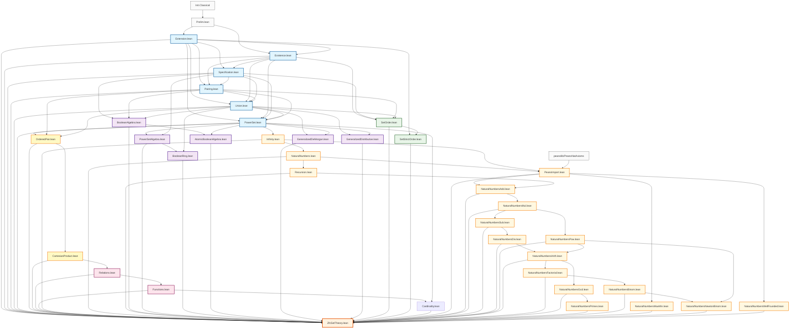

# Diagrama de Dependencias - ZfcSetTheory

**Última actualización:** 2026-03-27 09:00
**Autor**: Julián Calderón Almendros

## Estructura General del Proyecto

```text
ZfcSetTheory/
├── Prelim.lean                          # Definiciones preliminares
├── Extension.lean                       # Axioma de Extensionalidad
├── Existence.lean                       # Axioma de Existencia (conjunto vacío)
├── Specification.lean                   # Axioma de Especificación
├── Pairing.lean                         # Axioma de Pares
├── Union.lean                           # Axioma de Unión + Unión Binaria + Diferencia Simétrica
├── PowerSet.lean                        # Axioma del Conjunto Potencia
├── OrderedPair.lean                     # Extensiones del Par Ordenado
├── CartesianProduct.lean                # Producto Cartesiano A ×ₛ B
├── Relations.lean                       # Relaciones: equivalencia, orden, clases, dominio, rango
├── Functions.lean                       # Funciones, aplicación, composición, inversa
├── Infinity.lean                        # Axioma del Infinito y conjunto ω (nat_mem_wf)
├── NaturalNumbers.lean                  # Números naturales como ordinales de von Neumann
├── Recursion.lean                       # Teorema de Recursión sobre ℕ
├── PeanoImport.lean                     # Isomorfismo Von Neumann ↔ Peano
├── NaturalNumbersAdd.lean               # Suma en ω vía RecursiveFn + puente Peano
├── NaturalNumbersMul.lean               # Multiplicación en ω vía RecursiveFn + puente Peano
├── NaturalNumbersSub.lean               # Sustracción saturada en ω vía RecursiveFn
├── NaturalNumbersDiv.lean               # División euclídea Patrón B
├── NaturalNumbersPow.lean               # Potenciación en ω vía RecursiveFn
├── NaturalNumbersArith.lean             # Divisibilidad, GCD, LCM, Bézout
├── NaturalNumbersFactorial.lean         # Factorial en ω Patrón B
├── NaturalNumbersGcd.lean               # GCD/LCM ZFC-nativo (algoritmo euclídeo)
├── NaturalNumbersPrimes.lean            # Primalidad ZFC-nativa + TFA
├── NaturalNumbersBinom.lean             # Coeficientes binomiales Patrón B
├── NaturalNumbersMaxMin.lean            # Máximo y mínimo en ω Patrón B
├── NaturalNumbersNewtonBinom.lean       # Teorema binomial de Newton Patrón B
├── NaturalNumbersWellFounded.lean       # Buen fundamento y buena ordenación de ω
├── BooleanAlgebra.lean                  # Álgebra Booleana de conjuntos (teoremas)
├── BooleanRing.lean                     # Anillo Booleano con SymDiff
├── PowerSetAlgebra.lean                 # Álgebra del conjunto potencia (complemento, De Morgan)
├── GeneralizedDeMorgan.lean             # Leyes de De Morgan generalizadas para familias
├── GeneralizedDistributive.lean         # Leyes distributivas generalizadas
├── AtomicBooleanAlgebra.lean            # Álgebra de Boole atómica
├── SetOrder.lean                        # Orden parcial y retículos
├── SetStrictOrder.lean                  # Orden estricto
├── Cardinality.lean                     # Teoremas de Cantor y Cantor-Schröder-Bernstein
└── ZfcSetTheory.lean                    # Módulo principal (exporta todo)
```

## Diagrama de Dependencias


```mermaid
graph TD
    %% Nivel 0: Fundamentos
    IC[Init.Classical] --> P[Prelim.lean]
    
    %% Nivel 1: Axiomas básicos
    P --> E[Extension.lean]
    P --> Ex[Existence.lean]
    
    %% Nivel 2: Axiomas que dependen de Extension
    E --> Ex
    E --> S[Specification.lean]
    E --> Pa[Pairing.lean]
    E --> U[Union.lean]
    E --> Pot[PowerSet.lean]
    
    %% Nivel 3: Axiomas que dependen de Existence
    Ex --> S
    Ex --> Pa
    Ex --> U
    Ex --> Pot
    
    %% Nivel 4: Axiomas complejos
    S --> Pa
    S --> U
    S --> Pot
    Pa --> U
    Pa --> Pot
    U --> Pot
    
    %% Nivel 5: Extensiones del Par Ordenado
    Pot --> OP[OrderedPair.lean]
    Pa --> OP
    U --> OP
    
    %% Nivel 6: Producto Cartesiano
    OP --> CP[CartesianProduct.lean]
    
    %% Nivel 7: Relaciones y Funciones
    CP --> Rel[Relations.lean]
    Rel --> Func[Functions.lean]
    
    %% Nivel 8: Números Naturales
    Pot --> Inf[Infinity.lean]
    Inf --> Nat[NaturalNumbers.lean]
    Nat --> Rec[Recursion.lean]
    Nat --> PI[PeanoImport.lean]
    Inf --> PI
    PL[peanolib/PeanoNatAxioms] --> PI
    PI --> NA[NaturalNumbersAdd.lean]
    Rec --> NA
    NA --> NM[NaturalNumbersMul.lean]
    NM --> NS[NaturalNumbersSub.lean]
    NS --> ND[NaturalNumbersDiv.lean]
    NM --> NP[NaturalNumbersPow.lean]
    ND --> NAR[NaturalNumbersArith.lean]
    NP --> NAR
    NAR --> NF[NaturalNumbersFactorial.lean]
    NAR --> NG[NaturalNumbersGcd.lean]
    NG --> NPR[NaturalNumbersPrimes.lean]
    NF --> NB[NaturalNumbersBinom.lean]
    NB --> NNB[NaturalNumbersNewtonBinom.lean]
    NP --> NNB
    PI --> NMM[NaturalNumbersMaxMin.lean]
    PI --> NWF[NaturalNumbersWellFounded.lean]

    %% Nivel 9: Álgebras y órdenes
    E --> SSO[SetStrictOrder.lean]
    Ex --> SO[SetOrder.lean]
    S --> SO
    Pa --> SO
    U --> SO
    SO --> SSO
    S --> BA[BooleanAlgebra.lean]
    Pa --> BA
    U --> BA
    Pot --> PSA[PowerSetAlgebra.lean]
    S --> PSA
    PSA --> BR[BooleanRing.lean]
    U --> BR
    BA --> ABA[AtomicBooleanAlgebra.lean]
    Pot --> ABA
    U --> GDM[GeneralizedDeMorgan.lean]
    Pot --> GDM
    U --> GDD[GeneralizedDistributive.lean]
    Pot --> GDD
    
    %% Nivel 10: Cardinalidad
    Func --> Card[Cardinality.lean]
    Pot --> Card
    
    %% Nivel 11: Módulo principal
    E --> Z[ZfcSetTheory.lean]
    Ex --> Z
    S --> Z
    Pa --> Z
    U --> Z
    Pot --> Z
    OP --> Z
    CP --> Z
    Rel --> Z
    Func --> Z
    Inf --> Z
    Nat --> Z
    Rec --> Z
    BA --> Z
    PSA --> Z
    BR --> Z
    ABA --> Z
    GDM --> Z
    GDD --> Z
    SO --> Z
    SSO --> Z
    Card --> Z
    PI --> Z
    NA --> Z
    NM --> Z
    NS --> Z
    ND --> Z
    NP --> Z
    NAR --> Z
    NF --> Z
    NG --> Z
    NPR --> Z
    NB --> Z
    NMM --> Z
    NNB --> Z
    NWF --> Z

    %% Estilos
    classDef axiom fill:#e1f5fe,stroke:#01579b,stroke-width:2px
    classDef algebra fill:#f3e5f5,stroke:#4a148c,stroke-width:2px
    classDef order fill:#e8f5e8,stroke:#1b5e20,stroke-width:2px
    classDef extension fill:#fff9c4,stroke:#f57f17,stroke-width:2px
    classDef relation fill:#fce4ec,stroke:#880e4f,stroke-width:2px
    classDef functions fill:#e3f2fd,stroke:#0d47a1,stroke-width:2px
    classDef natural fill:#fff8e1,stroke:#f57c00,stroke-width:2px
    classDef main fill:#fff3e0,stroke:#e65100,stroke-width:3px
    classDef external fill:#fafafa,stroke:#424242,stroke-width:1px
    
    class E,Ex,S,Pa,U,Pot axiom
    class BA,PSA,BR,ABA,GDM,GDD algebra
    class SO,SSO order
    class OP,CP extension
    class Rel,Func relation
    class Inf,Nat,Rec,PI,NA,NM,NS,ND,NP,NAR,NF,NG,NPR,NB,NMM,NNB,NWF natural
    class Z main
    class IC,P,PL external
```

## Jerarquía de Espacios de Nombres

### 1. **SetUniverse** (Namespace raíz)

```lean
namespace SetUniverse
  -- Definición axiomática de pertenencia
  axiom mem (x y : U) : Prop
  notation:50 lhs:51 " ∈ " rhs:51 => mem lhs rhs
```

### 2. **SetUniverse.ExtensionAxiom**

```lean
namespace SetUniverse.ExtensionAxiom
  -- Axioma de Extensionalidad
  -- Definiciones: subseteq (⊆), subset (⊂), disjoint (⟂)
  -- Teoremas: orden parcial, igualdad de conjuntos
```

### 3. **SetUniverse.ExistenceAxiom**

```lean
namespace SetUniverse.ExistenceAxiom
  -- Axioma de Existencia del conjunto vacío
  -- Definiciones: EmptySet (∅)
  -- Teoremas: unicidad del vacío, propiedades básicas
```

### 4. **SetUniverse.SpecificationAxiom**

```lean
namespace SetUniverse.SpecificationAxiom
  -- Axioma de Especificación/Separación
  -- Definiciones: SpecSet, BinInter (∩), Difference (\)
  -- Teoremas: propiedades de intersección y diferencia
```

### 5. **SetUniverse.PairingAxiom**

```lean
namespace SetUniverse.PairingAxiom
  -- Axioma de Pares
  -- Definiciones: PairSet {a,b}, Singleton {a}, OrderedPair ⟨a,b⟩
  -- Teoremas: pares ordenados, relaciones, funciones
```

### 6. **SetUniverse.UnionAxiom**

```lean
namespace SetUniverse.UnionAxiom
  -- Axioma de Unión
  -- Definiciones: UnionSet (⋃), BinUnion (∪), SymDiff (△)
  -- Teoremas: propiedades de unión de familias y binaria
```

### 7. **SetUniverse.PowerSetAxiom**

```lean
namespace SetUniverse.PowerSetAxiom
  -- Axioma del Conjunto Potencia
  -- Definiciones: PowerSetOf (𝒫)
  -- Teoremas: caracterización, monotonía, propiedades con ∩ y ∪
```

### 8. **SetUniverse.OrderedPairExtensions**

```lean
namespace SetUniverse.OrderedPairExtensions
  -- Extensiones del Par Ordenado
  -- Teoremas: OrderedPair_eq_of, OrderedPair_eq_iff, OrderedPair_in_PowerSet
```

### 9. **SetUniverse.CartesianProduct**

```lean
namespace SetUniverse.CartesianProduct
  -- Producto Cartesiano
  -- Definiciones: CartesianProduct (A ×ₛ B)
  -- Teoremas: caracterización, vacío, monotonía, distributividad
```

### 10. **SetUniverse.Relations**

```lean
namespace SetUniverse.Relations
  -- Relaciones sobre conjuntos
  -- Definiciones: isRelationOn, isReflexiveOn, isSymmetricOn, etc.
  -- Tipos: equivalencia, preorden, orden parcial, orden lineal, orden estricto
  -- Construcciones: EqClass, QuotientSet, IdRel, InverseRel
  -- Operadores: domain, range, imag (dominio y rango de relaciones)
  -- Teoremas: propiedades de relaciones, clases de equivalencia, dominio y rango
```

### 11. **SetUniverse.Functions**

```lean
namespace SetUniverse.Functions
  -- Funciones y aplicaciones
  -- Definiciones: isFunctionFromTo, apply (⦅⦆), composition, inverse
  -- Teoremas: propiedades de funciones, composición, aplicación
```

### 12. **SetUniverse.InfinityAxiom**

```lean
namespace SetUniverse.InfinityAxiom
  -- Axioma del Infinito
  -- Definiciones: isInductive, InfSet (conjunto infinito)
  -- Teoremas: existencia de conjunto inductivo infinito
```

### 13. **SetUniverse.NaturalNumbers**

```lean
namespace SetUniverse.NaturalNumbers
  -- Números naturales como ordinales de von Neumann
  -- Definiciones: isNatural, ℕ (conjunto omega), successor
  -- Teoremas: propiedades de números naturales, inducción
```

### 14. **SetUniverse.NaturalNumbersAdd**

```lean
namespace SetUniverse.NaturalNumbersAdd
  -- Suma de naturales de von Neumann vía Recursión
  -- Definiciones: successorFn, addFn, add
  -- Teoremas: semianillo conmutativo (add_zero, zero_add, add_succ, add_comm, add_assoc,
  --           add_left_cancel, add_right_cancel, add_pos_left, add_pos_right,
  --           add_lt_of_lt, add_le_left, add_le_right, fromPeano_add)
  -- Depende de: PeanoImport, Recursion
```

### 14b. **SetUniverse.NaturalNumbersMul**

```lean
namespace SetUniverse.NaturalNumbersMul
  -- Multiplicación de naturales de von Neumann vía Recursión
  -- Definiciones: mulFn, mul
  -- Teoremas: anillo conmutativo (mul_zero, zero_mul, mul_succ, mul_comm,
  --           mul_assoc, mul_one, one_mul, mul_ldistr, mul_rdistr, fromPeano_mul)
  -- Depende de: NaturalNumbersAdd, PeanoImport, Recursion
```

### 15. **SetUniverse.Recursion**

```lean
namespace SetUniverse.Recursion
  -- Teorema de Recursión sobre ℕ
  -- Teoremas: recursión, unicidad de funciones recursivas
```

### 15. **SetUniverse.BooleanAlgebra**

```lean
namespace SetUniverse.BooleanAlgebra
  -- Álgebra Booleana de conjuntos
  -- Teoremas: leyes booleanas, distributividad, idempotencia
```

### 16. **SetUniverse.PowerSetAlgebra**

```lean
namespace SetUniverse.PowerSetAlgebra
  -- Álgebra del conjunto potencia
  -- Definiciones: Complement (X^∁[ A ]), ComplementFamily
  -- Teoremas: double_complement, DeMorgan_union_family, DeMorgan_inter_family
```

### 17. **SetUniverse.BooleanRing**

```lean
namespace SetUniverse.BooleanRing
  -- Anillo Booleano con SymDiff
  -- Teoremas: SymDiff como suma, intersección como producto
  --           asociatividad, distributividad, conmutatividad
```

### 18. **SetUniverse.GeneralizedDeMorgan**

```lean
namespace SetUniverse.GeneralizedDeMorgan
  -- Leyes de De Morgan generalizadas
  -- Teoremas: complement_union_eq_inter_complement, complement_inter_eq_union_complement
```

### 19. **SetUniverse.GeneralizedDistributive**

```lean
namespace SetUniverse.GeneralizedDistributive
  -- Leyes distributivas generalizadas
  -- Definiciones: DistribSet
  -- Teoremas: inter_union_distrib, union_inter_distrib
```

### 20. **SetUniverse.AtomicBooleanAlgebra**

```lean
namespace SetUniverse.AtomicBooleanAlgebra
  -- Álgebra de Boole atómica
  -- Definiciones: isAtom, Atoms, isAtomic, atomBelow
  -- Teoremas: singleton_is_atom, atom_is_singleton, atom_iff_singleton
  --           PowerSet_is_atomic, element_is_union_of_atoms
```

### 21. **SetUniverse.SetOrder**

```lean
namespace SetUniverse.SetOrder
  -- Orden parcial y estructura de retículo
  -- Definiciones: isUpperBound, isLowerBound, isSupremum, isInfimum
  -- Teoremas: propiedades de orden, cotas, supremos/ínfimos
```

### 22. **SetUniverse.SetStrictOrder**

```lean
namespace SetUniverse.SetStrictOrder
  -- Orden estricto
  -- Teoremas: irreflexividad, asimetría, transitividad
  -- Relaciones entre orden parcial y estricto
```

### 23. **SetUniverse.Cardinality**

```lean
namespace SetUniverse.Cardinality
  -- Teoría de Cardinalidad
  -- Definiciones: DiagonalSet, SetDiff, singletonMap, CSB_core, CSB_bijection
  -- Teoremas de Cantor: cantor_no_surjection, cantor_no_bijection
  -- Teorema de Cantor-Schröder-Bernstein: cantor_schroeder_bernstein
```

## Dependencias por Nivel

### **Nivel 0: Fundamentos**

- `Prelim.lean` - Definiciones básicas (ExistsUnique, etc.)

### **Nivel 1: Axiomas Básicos**

- `Extension.lean` - Axioma de Extensionalidad
- `Existence.lean` - Axioma de Existencia

### **Nivel 2: Axiomas de Construcción**

- `Specification.lean` - Construcción por especificación
- `Pairing.lean` - Construcción de pares
- `Union.lean` - Construcción de uniones + operaciones binarias

### **Nivel 3: Axiomas Avanzados**

- `PowerSet.lean` - Construcción de conjunto potencia

### **Nivel 4: Extensiones del Par Ordenado**

- `OrderedPair.lean` - Teoremas adicionales sobre pares ordenados

### **Nivel 5: Producto Cartesiano**

- `CartesianProduct.lean` - Producto cartesiano A ×ₛ B

### **Nivel 6: Relaciones**

- `Relations.lean` - Relaciones, equivalencias, órdenes, clases de equivalencia, dominio y rango

### **Nivel 7: Funciones**

- `Functions.lean` - Funciones, aplicación, composición, inversa

### **Nivel 8: Infinito y Números Naturales**

- `Infinity.lean` - Axioma del Infinito, conjunto inductivo, `nat_mem_wf`
- `NaturalNumbers.lean` - Números naturales como ordinales de von Neumann, `predecessor`
- `Recursion.lean` - Teorema de Recursión sobre ℕ (`RecursiveFn`, `RecursionTheoremWithStep`)
- `PeanoImport.lean` - Isomorfismo Von Neumann ↔ Peano (depende de `peanolib`) *(2026-03-04)*
- `NaturalNumbersAdd.lean` - Suma en ω vía RecursiveFn, puente `fromPeano_add`
- `NaturalNumbersMul.lean` - Multiplicación en ω vía RecursiveFn, puente `fromPeano_mul`
- `NaturalNumbersSub.lean` - Sustracción saturada (monus) vía RecursiveFn, puente `fromPeano_sub`
- `NaturalNumbersDiv.lean` - División euclídea Patrón B (`divOf`/`modOf`), puentes `fromPeano_div/mod`
- `NaturalNumbersPow.lean` - Potenciación vía RecursiveFn + `mulFn`, puente `fromPeano_pow`
- `NaturalNumbersArith.lean` - Divisibilidad ZFC-nativa, `gcdOf`/`lcmOf` Patrón B, Bézout, TFA
- `NaturalNumbersFactorial.lean` - Factorial Patrón B, puente `fromPeano_factorial`
- `NaturalNumbersGcd.lean` - GCD ZFC-nativo (algoritmo euclídeo), LCM, puentes `gcd_eq_gcdOf`/`lcm_eq_lcmOf`
- `NaturalNumbersPrimes.lean` - Primalidad ZFC-nativa (`isPrime`), TFA Enfoque A, puente `fromPeano_prime`
- `NaturalNumbersBinom.lean` - Coeficientes binomiales Patrón B (`binomOf`), regla de Pascal
- `NaturalNumbersMaxMin.lean` - Máximo/mínimo Patrón B (`maxOf`/`minOf`), 27 teoremas
- `NaturalNumbersNewtonBinom.lean` - Teorema binomial de Newton Patrón B 4-arg (`binomTermOf`)
- `NaturalNumbersWellFounded.lean` - Buen fundamento (`acc_lt_Omega`), buena ordenación (`well_ordering_Omega`)

### **Nivel 9: Estructuras Algebraicas**

- `BooleanAlgebra.lean` - Teoremas booleanos
- `BooleanRing.lean` - Anillo booleano con SymDiff
- `PowerSetAlgebra.lean` - Álgebra del conjunto potencia
- `GeneralizedDeMorgan.lean` - De Morgan generalizadas
- `GeneralizedDistributive.lean` - Distributivas generalizadas
- `AtomicBooleanAlgebra.lean` - Álgebra de Boole atómica
- `SetOrder.lean` - Estructura de orden y retículo
- `SetStrictOrder.lean` - Orden estricto

### **Nivel 10: Cardinalidad**

- `Cardinality.lean` - Teoremas de Cantor y Cantor-Schröder-Bernstein

### **Nivel 11: Integración**

- `ZfcSetTheory.lean` - Módulo principal que exporta todo

## Exports por Módulo

### Extension.lean

```lean
export SetUniverse (mem)
export SetUniverse.ExtensionAxiom (
    ExtSet, subseteq, subset, disjoint,
    subseteq_reflexive, subseteq_transitive, subseteq_antisymmetric,
    subset_irreflexive, subset_asymmetric, subset_transitive
)
```

### Existence.lean

```lean
export SetUniverse.ExistenceAxiom (
    ExistsAnEmptySet, ExistsUniqueEmptySet, EmptySet,
    EmptySet_is_empty, EmptySet_is_same, EmptySet_subseteq_any
)
```

### Specification.lean

```lean
export SetUniverse.SpecificationAxiom (
    Specification, SpecSet, SpecSet_is_specified,
    BinInter, BinInter_is_specified, BinInter_commutative,
    BinInter_associative, BinInter_absorbent_elem, BinInter_idempotent,
    BinInter_with_subseteq_full,
    Difference, Difference_is_specified, Difference_with_self,
    Difference_empty_right, Difference_empty_left
)
```

### Pairing.lean

```lean
export SetUniverse.PairingAxiom (
    Pairing, PairingUniqueSet, PairSet, PairSet_is_specified,
    Singleton, Singleton_is_specified, nonempty_iff_exists_mem,
    member_inter, interSet, interSet_of_singleton,
    OrderedPair, OrderedPair_is_specified, isOrderedPair,
    fst, snd, fst_of_ordered_pair, snd_of_ordered_pair,
    OrderedPairSet_is_WellConstructed,
    isRelation, isRelation_in_Sets,
    isReflexive, isIReflexive, isSymmetric, isAsymmetric,
    isAntiSymmetric, isTransitive,
    isEquivalenceRelation, isEquivalenceRelation_in_Set,
    Eq_of_OrderedPairs, OrderedPairsComp_eq, Eq_of_OrderedPairs_given_projections,
    pair_set_eq_singleton, ordered_pair_self_eq_singleton_singleton,
    isFunction, isTotalFunction, isInyective, isSurjectiveFunction, isBijectiveFunction
)
```

### Union.lean

```lean
export SetUniverse.UnionAxiom (
  Union, UnionExistsUnique, Union_is_specified,
  UnionSet, UnionSet_is_empty, UnionSet_is_empty',
  UnionSet_is_specified, UnionSet_is_unique,
  Set_is_empty_1, Set_is_empty_2, Set_is_empty_3,
  UnionSetIsEmpty_SetNonEmpty_SingletonEmptySet,
  BinUnion, BinUnion_is_specified, BinUnion_comm,
  BinUnion_empty_left, BinUnion_empty_right, BinUnion_idem, BinUnion_assoc,
  BinUnion_absorb_inter,
  SymDiff, SymDiff_is_specified, SymDiff_comm, SymDiff_empty_left, SymDiff_self
)
```

### PowerSet.lean

```lean
export SetUniverse.PowerSetAxiom (
  PowerSet, PowerSetExistsUnique, PowerSetOf,
  PowerSet_is_specified, PowerSet_is_unique,
  empty_mem_PowerSet, self_mem_PowerSet, PowerSet_nonempty, PowerSet_empty,
  PowerSet_mono, PowerSet_mono_iff, PowerSet_inter,
  PowerSet_union_subset, subset_PowerSet_Union, Union_PowerSet
)
```

### OrderedPair.lean

```lean
export SetUniverse.OrderedPairExtensions (
  OrderedPair_eq_of, OrderedPair_eq_iff, OrderedPair_in_PowerSet
)
```

### CartesianProduct.lean

```lean
export SetUniverse.CartesianProduct (
  CartesianProduct,
  CartesianProduct_is_specified,
  OrderedPair_mem_CartesianProduct,
  CartesianProduct_empty_left,
  CartesianProduct_empty_right,
  CartesianProduct_mono,
  CartesianProduct_distrib_union_left,
  CartesianProduct_distrib_union_right,
  CartesianProduct_distrib_inter_left,
  CartesianProduct_distrib_inter_right
)
```

### Relations.lean

```lean
export SetUniverse.Relations (
    isRelationOn, isRelationFrom, Related,
    isReflexiveOn, isIrreflexiveOn, isSymmetricOn, isAntiSymmetricOn, isAsymmetricOn,
    isTransitiveOn, isConnectedOn, isStronglyConnectedOn, isTrichotomousOn,
    isEquivalenceOn, isPreorderOn, isPartialOrderOn, isLinearOrderOn,
    isStrictOrderOn, isStrictPartialOrderOn, isStrictLinearOrderOn,
    isWellFoundedOn, isWellOrderOn,
    EqClass, QuotientSet, IdRel, InverseRel,
    Asymmetric_implies_Irreflexive, StrictOrder_is_Irreflexive,
    StrictPartialOrder_is_Irreflexive, Irreflexive_Transitive_implies_Asymmetric,
    Asymmetric_iff_Irreflexive_and_AntiSymmetric,
    PartialOrder_Connected_is_LinearOrder, LinearOrder_comparable,
    StrictOrder_Connected_is_Trichotomous, StrictLinearOrder_iff_StrictOrder_Connected,
    mem_IdRel, IdRel_is_Equivalence, mem_EqClass, EqClass_mem_self,
    mem_EqClass_of_Related, Related_of_mem_EqClass, mem_EqClass_iff,
    EqClass_eq_iff, EqClass_eq_or_disjoint,
    domain, range, imag,
    mem_domain, mem_range, mem_imag,
    pair_mem_implies_fst_in_domain, pair_mem_implies_snd_in_range, pair_mem_implies_snd_in_imag
)
```

### Functions.lean

```lean
export SetUniverse.Functions (
    isFunctionFromTo, apply, composition, inverse,
    function_iff, apply_mem, apply_eq, apply_unique,
    composition_assoc, inverse_involutive
)
```

### Infinity.lean

```lean
export SetUniverse.InfinityAxiom (
    InfinityAxiom, isInductive, InfSet,
    InfSet_is_inductive, zero_in_InfSet, successor_in_InfSet,
    nat_mem_wf  -- añadido 2026-03-04
)
```

### NaturalNumbers.lean

```lean
export SetUniverse.NaturalNumbers (
    isNatural, ℕ, successor, zero_is_natural,
    successor_is_natural, nat_induction,
    -- Añadidos 2026-03-04:
    predecessor, predecessor_of_successor, predecessor_is_nat, predecessor_mem
)
```

### PeanoImport.lean

```lean
-- Namespace: SetUniverse (no sub-namespace propio)
-- Depende de: NaturalNumbers, Infinity, PeanoNatLib.PeanoNatAxioms
-- Definiciones:
noncomputable def fromPeano : Peano.ℕ₀ → U
noncomputable def toPeano (n : U) (hn : isNat n) : Peano.ℕ₀
-- Teoremas: fromPeano_is_nat, fromPeano_injective, fromPeano_surjective,
--           fromPeano_toPeano, toPeano_fromPeano, toPeano_injective, toPeano_surjective
```

### NaturalNumbersAdd.lean

```lean
export SetUniverse.NaturalNumbersAdd (
    successorFn, addFn, add,
    add_zero_Omega, zero_add_Omega, add_succ_Omega, succ_add_Omega,
    add_comm_Omega, add_assoc_Omega,
    add_left_cancel_Omega, add_right_cancel_Omega,
    add_pos_left_Omega, add_pos_right_Omega,
    le_then_exists_add_Omega, add_lt_of_lt_Omega,
    add_le_left_Omega, add_le_right_Omega,
    lt_add_of_pos_right_Omega, lt_add_of_pos_left_Omega,
    fromPeano_add, add_in_Omega
)
```

### NaturalNumbersMul.lean

```lean
export SetUniverse.NaturalNumbersMul (
    mulFn, mul,
    mul_zero_Omega, zero_mul_Omega, mul_succ,
    mul_comm_Omega, succ_mul_Omega,
    mul_one_Omega, one_mul_Omega,
    mul_assoc_Omega, mul_ldistr_Omega, mul_rdistr_Omega,
    mul_in_Omega, mul_lt_left_Omega, mul_le_left_Omega,
    fromPeano_mul
)
```

### Recursion.lean

```lean
export SetUniverse.Recursion (
    recursion_theorem, recursion_unique
)
```

### BooleanAlgebra.lean

```lean
export SetUniverse.BooleanAlgebra (
    BinUnion_comm_ba, BinUnion_empty_left_ba, BinUnion_empty_right_ba,
    BinUnion_idem_ba, BinInter_idem_ba, BinInter_empty,
    BinInter_comm_ba, Subseteq_trans_ba, Subseteq_reflexive_ba,
    Union_monotone, Inter_monotone, Subseteq_inter_eq, Diff_self, Diff_empty
)
```

### BooleanRing.lean

```lean
export SetUniverse.BooleanRing (
    SymDiff_is_comm, SymDiff_empty_identity, SymDiff_self_eq_empty,
    SymDiff_assoc, SymDiff_inter_distrib_left, SymDiff_inter_distrib_right,
    SymDiff_eq_union_diff, SymDiff_eq_self_iff_empty,
    inter_SymDiff_distrib_left, inter_SymDiff_distrib_right,
    SymDiff_involution
)
```

### PowerSetAlgebra.lean

```lean
export SetUniverse.PowerSetAlgebra (
    Complement, ComplementFamily,
    PowerSet_Complement_subset, PowerSet_double_complement,
    PowerSet_complement_union, PowerSet_complement_inter,
    PowerSet_complement_complement, PowerSet_DeMorgan_union,
    PowerSet_DeMorgan_inter, PowerSet_complement_monotone,
    PowerSet_complement_distrib_union, PowerSet_complement_distrib_inter,
    PowerSet_union_absorb_complement, PowerSet_inter_absorb_complement,
    PowerSet_complement_empty, PowerSet_complement_full,
    PowerSet_complement_idempotent
)
```

### GeneralizedDeMorgan.lean

```lean
export SetUniverse.GeneralizedDeMorgan (
    complement_union_eq_inter_complement, complement_inter_eq_union_complement,
    inter_complement_eq_complement_union, union_complement_eq_complement_inter
)
```

### GeneralizedDistributive.lean

```lean
export SetUniverse.GeneralizedDistributive (
    DistribSet, DistribSet_is_specified,
    inter_union_distrib, union_inter_distrib,
    inter_union_distrib', union_inter_distrib'
)
```

### AtomicBooleanAlgebra.lean

```lean
export SetUniverse.AtomicBooleanAlgebra (
    isAtom, Atoms, isAtomic, atomBelow,
    singleton_is_atom, atom_is_singleton, atom_iff_singleton,
    PowerSet_is_atomic, element_is_union_of_atoms
)
```

### SetOrder.lean

```lean
export SetUniverse.SetOrder (
    isUpperBound, isLowerBound, isSupremum, isInfimum,
    empty_is_minimum, any_family_bounded_below,
    inter_is_glb, union_is_lub,
    union_monotone_left, union_monotone_right,
    inter_monotone_left, inter_monotone_right
)
```

### SetStrictOrder.lean

```lean
export SetUniverse.SetStrictOrder (
    strict_order_irreflexive, strict_order_asymmetric,
    strict_order_transitive, partial_to_strict_order
)
```

### NaturalNumbersSub.lean

```lean
export SetUniverse.NaturalNumbersSub (
    predecessorFn, subFn, sub,
    sub_zero_Omega, zero_sub_Omega, sub_self_Omega,
    sub_succ_succ_Omega, sub_k_add_k_Omega, add_k_sub_k_Omega,
    sub_le_self_Omega, sub_pos_iff_lt_Omega,
    sub_in_Omega, fromPeano_sub
)
```

### NaturalNumbersDiv.lean

```lean
export SetUniverse.NaturalNumbersDiv (
    divOf, modOf,
    divOf_in_Omega, modOf_in_Omega,
    fromPeano_div, fromPeano_mod,
    divMod_eq_Omega, mod_lt_divisor_Omega,
    div_of_lt_Omega, mod_of_lt_Omega, div_le_self_Omega
)
```

### NaturalNumbersPow.lean

```lean
export SetUniverse.NaturalNumbersPow (
    powFn, pow,
    pow_zero, pow_succ, pow_eq, pow_in_Omega,
    fromPeano_pow,
    zero_pow_Omega, one_pow_Omega, pow_one_Omega,
    pow_ne_zero_Omega, pow_two_Omega,
    pow_add_eq_mul_pow_Omega, mul_pow_Omega, pow_pow_eq_pow_mul_Omega,
    powFn_is_function
)
```

### NaturalNumbersArith.lean

```lean
export SetUniverse.NaturalNumbersArith (
    divides, div, mod,
    div_eq_divOf, mod_eq_modOf,
    gcdOf, lcmOf,
    fromPeano_gcd, fromPeano_lcm,
    divides_refl_Omega, divides_trans_Omega, divides_zero_Omega,
    divides_one_Omega, one_divides_Omega,
    divides_add_Omega, divides_mul_left_Omega, divides_mul_right_Omega,
    gcd_divides_left_Omega, gcd_divides_right_Omega, gcd_greatest_Omega,
    gcdOf_in_Omega, lcmOf_in_Omega, lcm_multiple_left_Omega,
    lcm_multiple_right_Omega, lcm_least_Omega,
    bezout_natform_Omega,
    fundamental_theorem_arithmetic
)
```

### NaturalNumbersFactorial.lean

```lean
export SetUniverse.NaturalNumbersFactorial (
    factorialOf,
    factorialOf_zero, factorialOf_one, factorialOf_two,
    factorialOf_succ, factorialOf_pos, factorialOf_ne_zero,
    factorialOf_ge_one, factorialOf_le_succ, factorialOf_le_mono,
    factorialOf_in_Omega, fromPeano_factorial
)
```

### NaturalNumbersGcd.lean

```lean
export SetUniverse.NaturalNumbersGcd (
    gcd, lcm,
    gcd_in_Omega, lcm_in_Omega,
    gcd_zero, gcd_pos_step,
    gcd_eq_gcdOf, lcm_eq_lcmOf,
    gcd_divides_left_Omega, gcd_divides_right_Omega, gcd_greatest_Omega,
    gcd_comm_Omega, lcm_multiple_left_Omega, lcm_multiple_right_Omega,
    lcm_comm_Omega
)
```

### NaturalNumbersPrimes.lean

```lean
export SetUniverse.NaturalNumbersPrimes (
    isPrime, fromPeano_prime,
    isPrime_in_Omega, isPrime_ne_zero, isPrime_ne_one,
    isPrime_ge_two, isPrime_prime_divisors,
    exists_prime_divisor_ZFC,
    exists_prime_factorization_ZFC, unique_prime_factorization_ZFC
)
```

### NaturalNumbersBinom.lean

```lean
export SetUniverse.NaturalNumbersBinom (
    binomOf, fromPeano_binom,
    binomOf_n_zero, binomOf_n_n, binomOf_n_one,
    binomOf_one_succ, binomOf_pascal, binomOf_succ_n_by_n,
    binomOf_comm, binomOf_zero_pos, binomOf_le_vanish,
    binomOf_mul_factorials, binomOf_add_n_zero, binomOf_add_zero_n,
    binomOf_in_Omega
)
```

### NaturalNumbersMaxMin.lean

```lean
export SetUniverse.NaturalNumbersMaxMin (
    maxOf, minOf, fromPeano_max, fromPeano_min,
    maxOf_in_Omega, minOf_in_Omega,
    maxOf_idem, minOf_idem,
    maxOf_comm, minOf_comm,
    maxOf_assoc, minOf_assoc,
    maxOf_zero_l, maxOf_zero_r, minOf_zero_l, minOf_zero_r,
    maxOf_le_left, maxOf_le_right, minOf_le_left, minOf_le_right,
    le_maxOf_left, le_maxOf_right, minOf_le_maxOf,
    maxOf_eq_left, maxOf_eq_right, minOf_eq_left, minOf_eq_right,
    maxOf_eq_iff, minOf_eq_iff
)
```

### NaturalNumbersNewtonBinom.lean

```lean
export SetUniverse.NaturalNumbersNewtonBinom (
    binomTermOf, fromPeano_binomTerm,
    binomTermOf_in_Omega,
    binomTerm_k_zero, binomTerm_k_n,
    pow_add_split, newton_binom_peano, sum_binom_eq_pow_two_peano,
    binomTerm_pos, binomTerm_bound_exists,
    binomTermOf_zero_zero
)
```

### NaturalNumbersWellFounded.lean

```lean
export SetUniverse.NaturalNumbersWellFounded (
    acc_lt_Omega, well_ordering_Omega, well_ordering_Omega_exists
)
```

### Cardinality.lean

```lean
export SetUniverse.Cardinality (
    -- Teorema de Cantor
    DiagonalSet, DiagonalSet_is_specified, DiagonalSet_not_in_range,
    cantor_no_surjection, cantor_no_bijection,
    singletonMap, singletonMap_is_specified, singletonMap_is_function,
    singletonMap_is_injective, cantor_strict_dominance, cantor_not_equipotent,
    -- Teorema de Cantor-Schröder-Bernstein
    SetDiff, SetDiff_is_specified, isCSB_closed, CSB_core, CSB_core_is_specified,
    CSB_bijection, CSB_bijection_is_specified, CSB_bijection_is_bijection,
    cantor_schroeder_bernstein
)
```

## Notas de Diseño

1. **Separación de Responsabilidades**: Cada módulo maneja un aspecto específico de ZFC
2. **Dependencias Mínimas**: Solo se importa lo estrictamente necesario
3. **Exports Selectivos**: Solo se exportan las definiciones y teoremas públicos
4. **Jerarquía Clara**: Los axiomas básicos no dependen de los complejos
5. **Modularidad**: Cada namespace es independiente y reutilizable
6. **Sin Mathlib**: El proyecto no depende de Mathlib, solo de `Init.Classical`

## Comandos de Verificación

```bash
# Compilar todo el proyecto
lake build

# Ver errores de compilación
lake build 2>&1

# Limpiar y recompilar
lake clean && lake build
```
