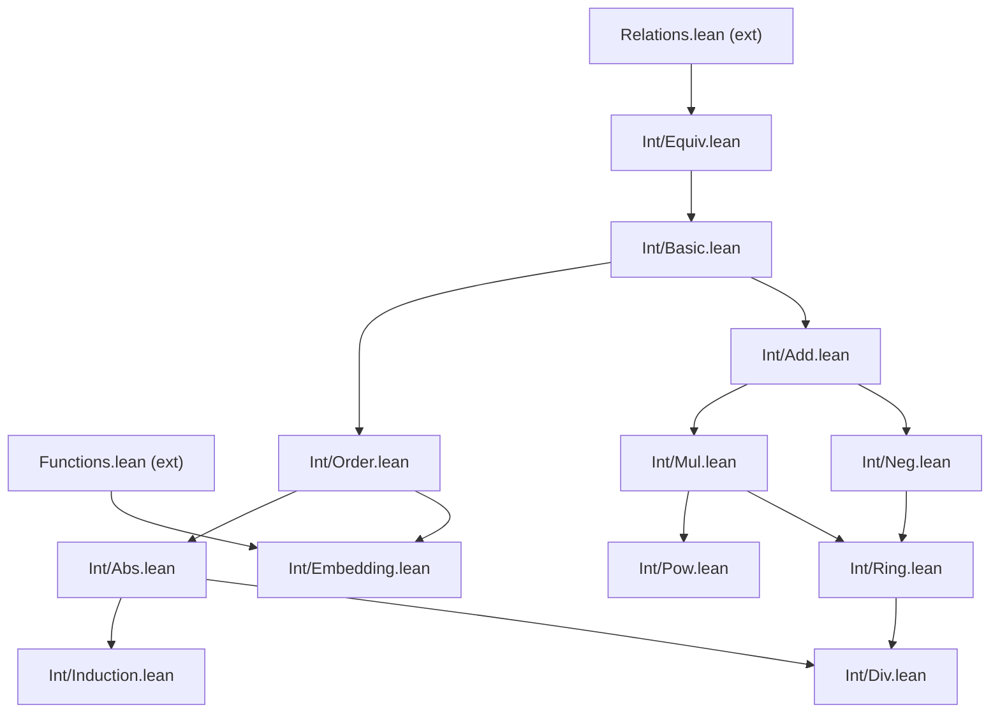

# Next Steps — ZfcSetTheory Project

**Last updated**: 2026-04-06

---

## Completed Milestones

All major development through Boolean algebra theory is complete:

- ✅ **Aritmética en ω** (14 módulos): TFA, binomiales, maxmin, Newton, well-foundedness, GCD/LCM nativo
- ✅ **Secuencias finitas** (3 módulos): isFinSeq, seqSum/seqProd, familyProduct, puente DList↔ZFC, TFA nativo
- ✅ **Conjuntos finitos** (1 módulo): isFiniteSet, biyecciones, equipotencia
- ✅ **Cardinalidad** (2 módulos): Cantor, CSB, |𝒫(F)|=2^n
- ✅ **Álgebras de Boole** (11 módulos): Basic, Ring, PowerSetAlgebra, GenDeMorgan, GenDistributive, Atomic, Complete, Representation, FiniteCofinite, FiniteBA, BoolRingBA — los 6 items de §3.1 completos
- ✅ **Reorganización Fases 1–3**: directorios, namespaces `ZFC`, convenciones Mathlib (185 renames)
- ✅ **Enteros ℤ** (15 módulos): Equiv, Basic, Add, Neg, Mul, Ring, Sub, DivMod, Order, Embedding, Abs, Div, Pow, Induction — 183 exports, 0 sorry

**Estado**: 75 jobs, 0 sorry, 0 errores de compilación.

---

## 1. Phase 4: Annotation System — ✅ Complete

Metadata annotations added to REFERENCE.md:

- ✅ `@axiom_system`: §1.2 "Axiomas ZFC por Módulo" — 47 módulos clasificados por axiomas usados transitivamente
- ✅ `@importance`: high/medium/low para todos los teoremas
  - §4.1–§4.18 (NEW §4): anotaciones per-theorem inline (~280+ teoremas)
  - §4.19–§4.41 (NEW §4): bloques module-level por sección/teorema (23 módulos)
  - §4.1–§4.7 (OLD §4): bloques per-theorem para Nat.Basic (7 subsecciones)

---

## 2. Phase 5: Enteros ℤ en ZFC — Plan detallado

### 2.0. Pre-requisito: Infraestructura de cocientes (Relations.lean + Functions.lean)

**Archivo**: `ZfcSetTheory/SetOps/Relations.lean` — extender al final (antes del export)

Actualmente `Relations.lean` (580 líneas) define `EqClass`, `QuotientSet`, y los teoremas
`mem_EqClass`, `EqClass_mem_self`, `mem_EqClass_of_Related`, `Related_of_mem_EqClass`,
`mem_EqClass_iff`, `EqClass_eq_iff`, `EqClass_eq_or_disjoint`. Pero **falta** lo siguiente:

#### 2.0.1. Nuevos teoremas en Relations.lean

| # | Nombre propuesto | Enunciado | Propósito |
|---|-----------------|-----------|-----------|
| 1 | `mem_QuotientSet` | `C ∈ QuotientSet A R ↔ ∃ a, a ∈ A ∧ C = EqClass a R A` | Caracterización de pertenencia al cociente |
| 2 | `EqClass_mem_QuotientSet` | `a ∈ A → EqClass a R A ∈ QuotientSet A R` | Toda clase está en el cociente |
| 3 | `EqClass_nonempty` | `isEquivalenceOn R A → a ∈ A → EqClass a R A ≠ ∅` | Clases no vacías (contienen al menos a `a`) |
| 4 | `EqClass_subset` | `EqClass a R A ⊆ A` | Toda clase es subconjunto de `A` |
| 5 | `QuotientSet_covers` | `isEquivalenceOn R A → a ∈ A → ∃ C ∈ QuotientSet A R, a ∈ C` | Todo elemento pertenece a alguna clase |
| 6 | `QuotientSet_is_partition` | `isEquivalenceOn R A → ⋃(QuotientSet A R) = A` | Las clases cubren `A` |
| 7 | `EqClass_representative_exists` | `isEquivalenceOn R A → C ∈ QuotientSet A R → ∃ a, a ∈ A ∧ a ∈ C ∧ C = EqClass a R A` | Existencia de representante |
| 8 | `EqClass_eq_of_mem_both` | `isEquivalenceOn R A → x ∈ EqClass a R A → x ∈ EqClass b R A → EqClass a R A = EqClass b R A` | Si hay intersección, son iguales |

#### 2.0.2. Infraestructura de "lift" para funciones definidas sobre cocientes

| # | Nombre propuesto | Enunciado | Propósito |
|---|-----------------|-----------|-----------|
| 9 | `QuotientLift_well_defined` | Si `f : A → B` y `∀ x y, x ∈ A → y ∈ A → ⟨x,y⟩ ∈ R → f⦅x⦆ = f⦅y⦆`, entonces `f` induce una función bien definida en `QuotientSet A R → B` | Lift unario: funciones que respetan `~` pasan al cociente |
| 10 | `QuotientLift₂_well_defined` | Si `op : A × A → C` y `∀ a₁ a₂ b₁ b₂, a₁ ~ a₂ → b₁ ~ b₂ → op(a₁,b₁) ~ op(a₂,b₂)`, entonces `op` induce una operación bien definida en `QuotientSet → QuotientSet → QuotientSet` | Lift binario: operaciones como `addZ`, `mulZ` que toman dos clases de equivalencia y devuelven una clase |
| 11 | `QuotientLift₂_is_function` | El grafo funcional inducido por el lift binario es una `IsFunction` de `(Q ×ₛ Q)` a `Q` | La operación inducida es una función set-teórica |

**Nota**: Los lifts son el punto técnicamente más delicado. En ZFC puro, el grafo funcional del lift se construye así:

```
QuotientLiftGraph f R A B :=
  sep ((QuotientSet A R) ×ₛ B)
    (fun p => ∃ a, a ∈ A ∧ fst p = EqClass a R A ∧ snd p = f⦅a⦆)
```

Para el lift binario:

```
QuotientLift₂Graph op R A :=
  sep (((QuotientSet A R) ×ₛ (QuotientSet A R)) ×ₛ (QuotientSet A R))
    (fun p => ∃ a b, a ∈ A ∧ b ∈ A ∧
      fst (fst p) = EqClass a R A ∧
      snd (fst p) = EqClass b R A ∧
      snd p = EqClass (op a b) R A)
```

Hay que demostrar que estos grafos son funciones (`IsFunction`), lo cual requiere probar:

- **Totalidad**: para cada clase (o par de clases), existe un resultado
- **Buena definición**: el resultado no depende del representante elegido (aquí entra la hipótesis de que `f` o `op` respetan `~`)

#### 2.0.3. Extensión en Functions.lean (opcional pero conveniente)

| # | Nombre propuesto | Enunciado | Propósito |
|---|-----------------|-----------|-----------|
| 12 | `bijection_implies_equipotent` | `isBijection f A B → isEquipotent A B` | Conveniencia: toda biyección explícita da equipotencia |
| 13 | `equipotent_refl` | `isEquipotent A A` | Reflexividad de equipotencia |
| 14 | `equipotent_symm` | `isEquipotent A B → isEquipotent B A` | Simetría de equipotencia (usar inv) |
| 15 | `equipotent_trans` | `isEquipotent A B → isEquipotent B C → isEquipotent A C` | Transitividad de equipotencia (usar comp) |

Estos tres últimos puede que ya estén en Cardinal.Basic — verificar antes de duplicar.

---

### 2.1. Int/Equiv.lean — Relación de equivalencia en ω×ω

**Dependencias**: `Relations`, `CartesianProduct`, `Nat.Add`

**Definiciones**:

| # | Nombre | Tipo | Descripción |
|---|--------|------|-------------|
| 1 | `IntEquivRel` | `def ... : U` | Relación `R := sep ((ω×ₛω) ×ₛ (ω×ₛω)) (fun p => add (fst (fst p)) (snd (snd p)) = add (snd (fst p)) (fst (snd p)))` — es decir, `(a,b)~(c,d) ⟺ a+d = b+c` |

**Teoremas a demostrar**:

| # | Nombre | Enunciado | Notas |
|---|--------|-----------|-------|
| 1 | `IntEquivRel_is_relation` | `isRelationOn IntEquivRel (ω ×ₛ ω)` | IntEquivRel ⊆ (ω×ω) ×ₛ (ω×ω) |
| 2 | `IntEquivRel_refl` | `isReflexiveOn IntEquivRel (ω ×ₛ ω)` | a+b = b+a por conmutatividad |
| 3 | `IntEquivRel_symm` | `isSymmetricOn IntEquivRel (ω ×ₛ ω)` | Si a+d = b+c entonces c+b = d+a |
| 4 | `IntEquivRel_trans` | `isTransitiveOn IntEquivRel (ω ×ₛ ω)` | Si a+d = b+c y c+f = d+e entonces a+f = b+e. Requiere cancelación aditiva en ω |
| 5 | `IntEquivRel_is_equivalence` | `isEquivalenceOn IntEquivRel (ω ×ₛ ω)` | Combina 1-4 |

**Nota sobre transitividad**: La prueba de transitividad requiere la **cancelación aditiva** en ω: `a + n = b + n → a = b`. Verificar que este teorema existe en `Nat.Add` o `Nat.Arith` (debería estar como `add_cancel_right` o `add_right_cancel`).

---

### 2.2. Int/Basic.lean — Definición de ℤ y propiedades fundamentales

**Dependencias**: `Int.Equiv`, `Nat.Sub`

**Definiciones**:

| # | Nombre | Tipo | Descripción |
|---|--------|------|-------------|
| 1 | `IntSet` | `noncomputable def ... : U` | `ℤ := QuotientSet (ω ×ₛ ω) IntEquivRel` |
| 2 | `intClass` | `noncomputable def ... (a b : U) : U` | `intClass a b := EqClass ⟨a, b⟩ IntEquivRel (ω ×ₛ ω)` — la clase `[(a,b)]` |
| 3 | `zeroZ` | `noncomputable def ... : U` | `0_z := intClass ∅ ∅` — es decir `[(0,0)]` |
| 4 | `oneZ` | `noncomputable def ... : U` | `1_z := intClass (σ ∅) ∅` — es decir `[(1,0)]` |
| 5 | `isCanonicalPos` | `def ... (p : U) : Prop` | `p = ⟨a, ∅⟩` para algún `a ∈ ω` — representante canónico positivo |
| 6 | `isCanonicalNeg` | `def ... (p : U) : Prop` | `p = ⟨∅, b⟩` para algún `b ∈ ω` con `b ≠ ∅` — representante canónico negativo |
| 7 | `isCanonical` | `def ... (p : U) : Prop` | `isCanonicalPos p ∨ isCanonicalNeg p` |

**Teoremas**:

| # | Nombre | Enunciado | Notas |
|---|--------|-----------|-------|
| 1 | `intClass_mem_IntSet` | `a ∈ ω → b ∈ ω → intClass a b ∈ IntSet` | Toda clase pertenece a ℤ |
| 2 | `zeroZ_mem_IntSet` | `zeroZ ∈ IntSet` | |
| 3 | `oneZ_mem_IntSet` | `oneZ ∈ IntSet` | |
| 4 | `intClass_eq_iff` | `intClass a b = intClass c d ↔ add a d = add b c` | Igualdad de clases |
| 5 | `canonical_pos_exists` | `a ∈ ω → b ∈ ω → b ⊆ a → intClass a b = intClass (sub a b) ∅` | Si a ≥ b, el representante canónico es `(a-b, 0)` |
| 6 | `canonical_neg_exists` | `a ∈ ω → b ∈ ω → a ⊆ b → a ≠ b → intClass a b = intClass ∅ (sub b a)` | Si b > a, el representante canónico es `(0, b-a)` |
| 7 | `canonical_representative_exists` | `a ∈ ω → b ∈ ω → (∃ n ∈ ω, intClass a b = intClass n ∅) ∨ (∃ m ∈ ω, m ≠ ∅ ∧ intClass a b = intClass ∅ m)` | Todo entero tiene representante canónico |
| 8 | `canonical_representative_unique` | Si `intClass n ∅ = intClass m ∅` entonces `n = m`; si `intClass ∅ n = intClass ∅ m` con `n ≠ ∅, m ≠ ∅` entonces `n = m`; y `intClass n ∅ ≠ intClass ∅ m` cuando `n ≠ ∅` o `m ≠ ∅` (salvo `n = m = ∅`) | Unicidad del representante canónico |
| 9 | `int_trichotomy` | `z ∈ IntSet → (z = zeroZ) ∨ (∃ n ∈ ω, n ≠ ∅ ∧ z = intClass n ∅) ∨ (∃ m ∈ ω, m ≠ ∅ ∧ z = intClass ∅ m)` | **Tricotomía**: todo entero es cero, positivo, o negativo |

**Dependencia crítica**: Los teoremas 5-6 requieren la **resta truncada** (`sub`) de `Nat.Sub`, y demostrar que si `b ⊆ a` entonces `add (sub a b) b = a` (que la resta truncada es inversa derecha de la suma cuando a ≥ b). Verificar que existe o añadir en `Nat.Sub`.

---

### 2.3. Int/Add.lean — Suma en ℤ

**Dependencias**: `Int.Basic`, `Nat.Add`

**Definiciones**:

| # | Nombre | Tipo | Descripción |
|---|--------|------|-------------|
| 1 | `addZ_raw` | `def ... (a b c d : U) : U` | `intClass (add a c) (add b d)` — suma a nivel de representantes |
| 2 | `addZ_graph` | `noncomputable def ... : U` | Grafo funcional de la suma en ℤ, construido via `QuotientLift₂` de la operación subyacente `(a,b) + (c,d) := (a+c, b+d)` |
| 3 | `addZ` | `noncomputable def ... (x y : U) : U` | Suma en ℤ: `addZ x y := apply addZ_graph ⟨x, y⟩` |

**Teoremas**:

| # | Nombre | Enunciado |
|---|--------|-----------|
| 1 | `addZ_well_defined` | Si `(a₁,b₁) ~ (a₂,b₂)` y `(c₁,d₁) ~ (c₂,d₂)` entonces `(a₁+c₁, b₁+d₁) ~ (a₂+c₂, b₂+d₂)` |
| 2 | `addZ_graph_is_function` | `IsFunction addZ_graph (IntSet ×ₛ IntSet) IntSet` |
| 3 | `addZ_class` | `addZ (intClass a b) (intClass c d) = intClass (add a c) (add b d)` — regla de cómputo |
| 4 | `addZ_in_IntSet` | `x ∈ IntSet → y ∈ IntSet → addZ x y ∈ IntSet` — clausura |
| 5 | `addZ_comm` | `addZ x y = addZ y x` — conmutatividad |
| 6 | `addZ_assoc` | `addZ (addZ x y) z = addZ x (addZ y z)` — asociatividad |
| 7 | `addZ_zero_right` | `addZ x zeroZ = x` — identidad derecha |
| 8 | `addZ_zero_left` | `addZ zeroZ x = x` — identidad izquierda |

---

### 2.4. Int/Neg.lean — Negación y sustracción en ℤ

**Dependencias**: `Int.Add`

**Definiciones**:

| # | Nombre | Tipo | Descripción |
|---|--------|------|-------------|
| 1 | `negZ` | `noncomputable def ... (x : U) : U` | `negZ (intClass a b) := intClass b a` — negación: intercambiar componentes |
| 2 | `subZ` | `noncomputable def ... (x y : U) : U` | `subZ x y := addZ x (negZ y)` — sustracción como operación derivada |

**Teoremas**:

| # | Nombre | Enunciado |
|---|--------|-----------|
| 1 | `negZ_well_defined` | Si `(a,b) ~ (c,d)` entonces `(b,a) ~ (d,c)` |
| 2 | `negZ_in_IntSet` | `x ∈ IntSet → negZ x ∈ IntSet` — clausura |
| 3 | `negZ_class` | `negZ (intClass a b) = intClass b a` — regla de cómputo |
| 4 | `addZ_negZ_right` | `addZ x (negZ x) = zeroZ` — inverso aditivo derecho |
| 5 | `addZ_negZ_left` | `addZ (negZ x) x = zeroZ` — inverso aditivo izquierdo |
| 6 | `negZ_negZ` | `negZ (negZ x) = x` — involución |
| 7 | `negZ_zero` | `negZ zeroZ = zeroZ` |
| 8 | `negZ_addZ` | `negZ (addZ x y) = addZ (negZ x) (negZ y)` — homomorfismo |
| 9 | `subZ_self` | `subZ x x = zeroZ` |
| 10 | `subZ_in_IntSet` | `x ∈ IntSet → y ∈ IntSet → subZ x y ∈ IntSet` |

---

### 2.5. Int/Mul.lean — Producto en ℤ

**Dependencias**: `Int.Add`, `Nat.Mul`

**Definiciones**:

| # | Nombre | Tipo | Descripción |
|---|--------|------|-------------|
| 1 | `mulZ_raw` | `def ... (a b c d : U) : U` | `intClass (add (mul a c) (mul b d)) (add (mul a d) (mul b c))` — es decir `[(ac+bd, ad+bc)]` |
| 2 | `mulZ_graph` | `noncomputable def ... : U` | Grafo funcional via `QuotientLift₂` |
| 3 | `mulZ` | `noncomputable def ... (x y : U) : U` | Producto en ℤ |

**Teoremas**:

| # | Nombre | Enunciado |
|---|--------|-----------|
| 1 | `mulZ_well_defined` | Si `(a₁,b₁)~(a₂,b₂)` y `(c₁,d₁)~(c₂,d₂)` entonces `(a₁c₁+b₁d₁, a₁d₁+b₁c₁) ~ (a₂c₂+b₂d₂, a₂d₂+b₂c₂)` |
| 2 | `mulZ_graph_is_function` | `IsFunction mulZ_graph (IntSet ×ₛ IntSet) IntSet` |
| 3 | `mulZ_class` | `mulZ (intClass a b) (intClass c d) = intClass (add (mul a c) (mul b d)) (add (mul a d) (mul b c))` |
| 4 | `mulZ_in_IntSet` | clausura |
| 5 | `mulZ_comm` | conmutatividad |
| 6 | `mulZ_assoc` | asociatividad |
| 7 | `mulZ_one_right` | `mulZ x oneZ = x` |
| 8 | `mulZ_one_left` | `mulZ oneZ x = x` |
| 9 | `mulZ_zero_right` | `mulZ x zeroZ = zeroZ` — absorbente |
| 10 | `mulZ_zero_left` | `mulZ zeroZ x = zeroZ` |
| 11 | `mulZ_negZ_left` | `mulZ (negZ x) y = negZ (mulZ x y)` |
| 12 | `mulZ_negZ_right` | `mulZ x (negZ y) = negZ (mulZ x y)` |
| 13 | `negZ_mulZ_negZ` | `mulZ (negZ x) (negZ y) = mulZ x y` |

**Nota sobre `mulZ_well_defined`**: Esta es la demostración más técnica de todo el bloque de enteros. Requiere manipulación intensiva de aritmética de ω: distributividad, conmutatividad, asociatividad, y cancelación. Recomendación: demostrarla con lemas intermedios.

---

### 2.6. Int/Ring.lean — Estructura de anillo

**Dependencias**: `Int.Add`, `Int.Neg`, `Int.Mul`

**Teoremas**:

| # | Nombre | Enunciado |
|---|--------|-----------|
| 1 | `mulZ_addZ_distrib_left` | `mulZ x (addZ y z) = addZ (mulZ x y) (mulZ x z)` — distributividad izquierda |
| 2 | `mulZ_addZ_distrib_right` | `mulZ (addZ x y) z = addZ (mulZ x z) (mulZ y z)` — distributividad derecha |
| 3 | `IntSet_is_comm_ring` | `(IntSet, addZ, mulZ, zeroZ, oneZ, negZ)` satisface los axiomas de anillo conmutativo con unidad |
| 4 | `mulZ_cancel_left` | `mulZ z x = mulZ z y → z ≠ zeroZ → x = y` — cancelación multiplicativa (ℤ es dominio de integridad) |
| 5 | `mulZ_cancel_right` | `mulZ x z = mulZ y z → z ≠ zeroZ → x = y` |
| 6 | `mulZ_eq_zero_iff` | `mulZ x y = zeroZ ↔ x = zeroZ ∨ y = zeroZ` — sin divisores de cero |

**Unidades en ℤ**:

| # | Nombre | Enunciado |
|---|--------|-----------|
| 7 | `isUnitZ` | `def isUnitZ (u : U) : Prop := u ∈ IntSet ∧ ∃ v ∈ IntSet, mulZ u v = oneZ` |
| 8 | `unitZ_iff` | `isUnitZ u ↔ u = oneZ ∨ u = negZ oneZ` — las únicas unidades son ±1 |
| 9 | `mulZ_unit_preserve` | `isUnitZ u → mulZ u x ∈ IntSet → mulZ u x ≠ x → x ≠ zeroZ` |

---

### 2.7. Int/Order.lean — Orden total en ℤ

**Dependencias**: `Int.Basic`, `Nat.Add`

**Definiciones**:

| # | Nombre | Tipo | Descripción |
|---|--------|------|-------------|
| 1 | `leZ_rel` | `noncomputable def ... : U` | Relación `≤_z` en ℤ: `[(a,b)] ≤ [(c,d)] ⟺ a + d ≤ b + c` (donde `≤` en ω es `⊆`) |
| 2 | `ltZ_rel` | `noncomputable def ... : U` | Relación `<_z` en ℤ: `x <_z y ⟺ x ≤_z y ∧ x ≠ y` |
| 3 | `isPositiveZ` | `def ... (x : U) : Prop` | `ltZ zeroZ x` — x es positivo |
| 4 | `isNegativeZ` | `def ... (x : U) : Prop` | `ltZ x zeroZ` — x es negativo |
| 5 | `positiveZ` | `noncomputable def ... : U` | `ℤ⁺ := sep IntSet isPositiveZ` — conjunto de enteros positivos |
| 6 | `negativeZ` | `noncomputable def ... : U` | `ℤ⁻ := sep IntSet isNegativeZ` — conjunto de enteros negativos |

**Teoremas**:

| # | Nombre | Enunciado |
|---|--------|-----------|
| 1 | `leZ_well_defined` | `≤_z` no depende del representante |
| 2 | `leZ_refl` | `isReflexiveOn leZ_rel IntSet` |
| 3 | `leZ_antisymm` | `isAntiSymmetricOn leZ_rel IntSet` |
| 4 | `leZ_trans` | `isTransitiveOn leZ_rel IntSet` |
| 5 | `leZ_total` | `isConnectedOn leZ_rel IntSet` — o bien `isStronglyConnectedOn` |
| 6 | `leZ_is_linear_order` | `isLinearOrderOn leZ_rel IntSet` — combina 2-5 |
| 7 | `ltZ_is_strict_linear_order` | `isStrictLinearOrderOn ltZ_rel IntSet` |
| 8 | `int_trichotomy_order` | `x ∈ IntSet → isPositiveZ x ∨ x = zeroZ ∨ isNegativeZ x` — tricotomía vía orden |
| 9 | `addZ_le_addZ_left` | `x ≤_z y → addZ z x ≤_z addZ z y` — compatibilidad orden-suma |
| 10 | `addZ_le_addZ_right` | `x ≤_z y → addZ x z ≤_z addZ y z` |
| 11 | `mulZ_le_mulZ_nonneg` | `x ≤_z y → zeroZ ≤_z z → mulZ z x ≤_z mulZ z y` — compatibilidad orden-producto (z ≥ 0) |
| 12 | `mulZ_le_mulZ_nonpos` | `x ≤_z y → z ≤_z zeroZ → mulZ z y ≤_z mulZ z x` — producto por negativo invierte |
| 13 | `positiveZ_mul_closed` | `isPositiveZ x → isPositiveZ y → isPositiveZ (mulZ x y)` |
| 14 | `negativeZ_mul_positive` | `isNegativeZ x → isNegativeZ y → isPositiveZ (mulZ x y)` |
| 15 | `positiveZ_negativeZ_mul_negative` | `isPositiveZ x → isNegativeZ y → isNegativeZ (mulZ x y)` |

---

### 2.8. Int/Embedding.lean — Inyección canónica ω ↪ ℤ y equipotencia

**Dependencias**: `Int.Order`, `Functions`

**Definiciones**:

| # | Nombre | Tipo | Descripción |
|---|--------|------|-------------|
| 1 | `natToInt_graph` | `noncomputable def ... : U` | Grafo `{⟨n, intClass n ∅⟩ | n ∈ ω}` |
| 2 | `natToInt` | `noncomputable def ... (n : U) : U` | `natToInt n := intClass n ∅` |
| 3 | `intToNat_zigzag` | `noncomputable def ... : U` | Biyección zigzag ℤ → ω: `0↦0, 1↦1, -1↦2, 2↦3, -2↦4, ...` |

**Teoremas**:

| # | Nombre | Enunciado |
|---|--------|-----------|
| 1 | `natToInt_is_function` | `IsFunction natToInt_graph ω IntSet` |
| 2 | `natToInt_injective` | `isInjective natToInt_graph` |
| 3 | `natToInt_preserves_add` | `natToInt (add m n) = addZ (natToInt m) (natToInt n)` |
| 4 | `natToInt_preserves_mul` | `natToInt (mul m n) = mulZ (natToInt m) (natToInt n)` |
| 5 | `natToInt_preserves_le` | `m ⊆ n → leZ (natToInt m) (natToInt n)` — preserva orden |
| 6 | `natToInt_reflects_le` | `leZ (natToInt m) (natToInt n) → m ⊆ n` — refleja orden |
| 7 | `natToInt_not_surjective` | `¬ isSurjectiveOnto natToInt_graph IntSet` — ω ↪ ℤ no es sobre |
| 8 | `intToNat_zigzag_is_bijection` | `isBijection intToNat_zigzag IntSet ω` |
| 9 | `IntSet_equipotent_omega` | `isEquipotent IntSet ω` — **|ℤ| = |ω|** |

**Nota sobre la biyección zigzag**: La función concreta puede ser:

- `f(intClass n ∅) = mul (σ (σ ∅)) n` (es decir `2n`) para n ≥ 0
- `f(intClass ∅ m) = sub (mul (σ (σ ∅)) m) (σ ∅)` (es decir `2m - 1`) para m > 0

Alternativa más limpia usando Cantor pairing function si ya está disponible.

---

### 2.9. Int/Abs.lean — Valor absoluto y signo

**Dependencias**: `Int.Order`, `Int.Embedding`

**Definiciones**:

| # | Nombre | Tipo | Descripción |
|---|--------|------|-------------|
| 1 | `absZ` | `noncomputable def ... (x : U) : U` | `absZ x := if isPositiveZ x ∨ x = zeroZ then x else negZ x` — pero como conjunto, el resultado vive en ω (no en ℤ). Más preciso: `absZ (intClass a b) := sub a b` si `b ⊆ a`, o `sub b a` si `a ⊆ b`. El resultado es un natural. |
| 2 | `signZ` | `noncomputable def ... (x : U) : U` | `signZ x := oneZ` si positivo, `negZ oneZ` si negativo, `zeroZ` si cero |

**Teoremas**:

| # | Nombre | Enunciado |
|---|--------|-----------|
| 1 | `absZ_in_omega` | `x ∈ IntSet → absZ x ∈ ω` — el valor absoluto es un natural |
| 2 | `absZ_zero` | `absZ zeroZ = ∅` |
| 3 | `absZ_nonneg` | `absZ x = ∅ ↔ x = zeroZ` |
| 4 | `absZ_negZ` | `absZ (negZ x) = absZ x` |
| 5 | `absZ_mulZ` | `absZ (mulZ x y) = mul (absZ x) (absZ y)` — |xy| = |x|·|y| (resultado en ω) |
| 6 | `absZ_addZ_le` | `absZ (addZ x y) ⊆ add (absZ x) (absZ y)` ∨ con `≤` en ω — desigualdad triangular |
| 7 | `signZ_mulZ_absZ` | `x = mulZ (signZ x) (natToInt (absZ x))` — x = sign(x)·|x| |
| 8 | `signZ_values` | `signZ x = oneZ ∨ signZ x = negZ oneZ ∨ signZ x = zeroZ` |
| 9 | `signZ_mulZ` | `signZ (mulZ x y) = mulZ (signZ x) (signZ y)` — signo del producto |

---

### 2.10. Int/Div.lean — División y aritmética avanzada en ℤ

**Dependencias**: `Int.Ring`, `Int.Abs`, `Nat.Div`, `Nat.Gcd`

**Definiciones**:

| # | Nombre | Tipo | Descripción |
|---|--------|------|-------------|
| 1 | `dividesZ` | `def ... (a b : U) : Prop` | `a ∣_z b ⟺ ∃ q ∈ IntSet, b = mulZ a q` — divisibilidad en ℤ |
| 2 | `divZ` | `noncomputable def ... (a b : U) : U` | Cociente euclidiano: `a = mulZ (divZ a b) b + modZ a b` con `0 ≤ modZ a b < absZ b` |
| 3 | `modZ` | `noncomputable def ... (a b : U) : U` | Resto euclidiano |
| 4 | `gcdZ` | `noncomputable def ... (a b : U) : U` | `gcdZ a b := gcd (absZ a) (absZ b)` — resultado en ω |
| 5 | `lcmZ` | `noncomputable def ... (a b : U) : U` | `lcmZ a b := lcm (absZ a) (absZ b)` — resultado en ω |

**Teoremas**:

| # | Nombre | Enunciado |
|---|--------|-----------|
| 1 | `divZ_modZ_eq` | `b ≠ zeroZ → a = addZ (mulZ (divZ a b) b) (natToInt (modZ a b))` — algoritmo de división |
| 2 | `modZ_in_omega` | `modZ a b ∈ ω` |
| 3 | `modZ_lt_absZ` | `b ≠ zeroZ → modZ a b ∈ absZ b` — 0 ≤ r < |b| |
| 4 | `dividesZ_refl` | `a ≠ zeroZ → dividesZ a a` |
| 5 | `dividesZ_trans` | transitiva |
| 6 | `dividesZ_antisymm` | `dividesZ a b → dividesZ b a → a = b ∨ a = negZ b` — antisimetría salvo unidades |
| 7 | `bezoutZ` | `gcdZ a b = addZ (mulZ (natToInt s) a) (mulZ (natToInt t) b)` — identidad de Bézout en ℤ (elevada de ω via natToInt) |
| 8 | `gcdZ_dividesZ_left` | `dividesZ (natToInt (gcdZ a b)) a` |
| 9 | `gcdZ_dividesZ_right` | `dividesZ (natToInt (gcdZ a b)) b` |
| 10 | `gcdZ_is_greatest` | Si `dividesZ d a` y `dividesZ d b`, entonces `dividesZ d (natToInt (gcdZ a b))` |
| 11 | `associated_iff` | `def associated (a b : U) := ∃ u, isUnitZ u ∧ b = mulZ u a` — asociados |
| 12 | `tfa_Z` | TFA en ℤ: todo entero no nulo y no unidad es producto de irreducibles, único salvo orden y unidades |

---

### 2.11. Int/Pow.lean — Exponenciación con exponente natural

**Dependencias**: `Int.Mul`, `Nat.Pow`

**Definiciones**:

| # | Nombre | Tipo | Descripción |
|---|--------|------|-------------|
| 1 | `powZ` | `noncomputable def ... (x : U) (n : U) : U` | `x^0 = oneZ`, `x^(σn) = mulZ x (x^n)` — exponente n ∈ ω |

**Teoremas**:

| # | Nombre | Enunciado |
|---|--------|-----------|
| 1 | `powZ_zero` | `powZ x ∅ = oneZ` |
| 2 | `powZ_succ` | `powZ x (σ n) = mulZ x (powZ x n)` |
| 3 | `powZ_one` | `powZ x (σ ∅) = x` |
| 4 | `powZ_in_IntSet` | `x ∈ IntSet → n ∈ ω → powZ x n ∈ IntSet` — clausura |
| 5 | `powZ_addZ_exp` | `powZ x (add m n) = mulZ (powZ x m) (powZ x n)` — x^(m+n) = x^m · x^n |
| 6 | `powZ_mulZ_exp` | `powZ x (mul m n) = powZ (powZ x m) n` — x^(mn) = (x^m)^n |
| 7 | `powZ_mulZ_base` | `powZ (mulZ x y) n = mulZ (powZ x n) (powZ y n)` — (xy)^n = x^n · y^n |
| 8 | `powZ_negZ_even` | `powZ (negZ x) (mul (σ(σ ∅)) n) = powZ x (mul (σ(σ ∅)) n)` — (-x)^(2n) = x^(2n) |
| 9 | `powZ_negZ_odd` | `powZ (negZ x) (σ (mul (σ(σ ∅)) n)) = negZ (powZ x (σ (mul (σ(σ ∅)) n)))` — (-x)^(2n+1) = -(x^(2n+1)) |

---

### 2.12. Int/Induction.lean — Inducción fuerte sobre ℤ

**Dependencias**: `Int.Abs`, `Int.Order`, `Nat.WellFounded`

La inducción ordinaria sobre ω **no se transfiere** directamente a ℤ. En su lugar, definimos inducción sobre el valor absoluto.

**Teoremas**:

| # | Nombre | Enunciado |
|---|--------|-----------|
| 1 | `int_induction_abs` | `(P zeroZ) → (∀ n ∈ ω, n ≠ ∅ → P (intClass n ∅) → P (intClass (σ n) ∅)) → (∀ n ∈ ω, n ≠ ∅ → P (intClass ∅ n) → P (intClass ∅ (σ n))) → ∀ z ∈ IntSet, P z` — Inducción en ℤ: caso base 0, paso positivo, paso negativo |
| 2 | `int_strong_induction_abs` | `(∀ z ∈ IntSet, (∀ w ∈ IntSet, absZ w ∈ absZ z → P w) → P z) → ∀ z ∈ IntSet, P z` — Inducción fuerte: si P vale para todos los enteros con |w| < |z|, entonces P vale para z; por tanto, P vale para todo ℤ |
| 3 | `int_well_founded_abs` | La relación `w <_abs z ⟺ absZ w ∈ absZ z` es bien fundada en ℤ |
| 4 | `int_induction_nonneg` | `P zeroZ → (∀ n ∈ ω, P (natToInt n) → P (natToInt (σ n))) → ∀ n ∈ ω, P (natToInt n)` — Inducción restringida a ℤ≥0 (esencialmente la inducción de ω transportada) |

---

### 2.13. Resumen de módulos y dependencias para ℤ

```
SetOps/Relations.lean ── EXTENDER (§2.0.1, §2.0.2)
SetOps/Functions.lean ── EXTENDER (§2.0.3, si no está en Cardinal.Basic)
   │
   ▼
Int/
├── Equiv.lean           §2.1  [~ω×ω es equivalencia]
├── Basic.lean           §2.2  [ℤ := cociente, representantes canónicos, tricotomía]
├── Add.lean             §2.3  [suma, group abeliano parcial]
├── Neg.lean             §2.4  [negación, sustracción, grupo abeliano completo]
├── Mul.lean             §2.5  [producto, conmutativo]
├── Ring.lean            §2.6  [distributividad, anillo, unidades, DI]
├── Order.lean           §2.7  [≤_z orden total compatible, tricotomía]
├── Embedding.lean       §2.8  [ω ↪ ℤ, preserva ops, |ℤ|=|ω|]
├── Abs.lean             §2.9  [valor absoluto, signo]
├── Div.lean             §2.10 [división euclídea, GCD, Bézout, TFA en ℤ]
├── Pow.lean             §2.11 [exponenciación x^n con n ∈ ω]
└── Induction.lean       §2.12 [inducción fuerte vía |·|]

Int.lean                 Hub: import ZfcSetTheory.Int.*
```

**Diagrama de dependencias**:



**Orden de implementación recomendado** (lineal):

1. Relations.lean extensión (§2.0.1 + §2.0.2)
2. Functions.lean extensión (§2.0.3)
3. Int/Equiv.lean (§2.1)
4. Int/Basic.lean (§2.2)
5. Int/Add.lean (§2.3)
6. Int/Neg.lean (§2.4)
7. Int/Mul.lean (§2.5)
8. Int/Ring.lean (§2.6)
9. Int/Order.lean (§2.7)
10. Int/Embedding.lean (§2.8)
11. Int/Abs.lean (§2.9)
12. Int/Div.lean (§2.10)
13. Int/Pow.lean (§2.11)
14. Int/Induction.lean (§2.12)
15. Int.lean hub

---

## 3. Phase 6: Racionales ℚ en ZFC — Plan esquemático

**Pre-requisito**: Phase 5 completa (ℤ funcional)

### 3.1. Rat/Equiv.lean — Relación de equivalencia en ℤ×ℤ*

- Definir `IntNonzero := sep IntSet (fun z => z ≠ zeroZ)` — ℤ*
- Definir `RatEquivRel` en `IntSet ×ₛ IntNonzero`: `(a,b) ~ (c,d) ⟺ mulZ a d = mulZ b c`
- Demostrar `isEquivalenceOn RatEquivRel (IntSet ×ₛ IntNonzero)`
- **Nota transitividad**: requiere cancelación multiplicativa en ℤ (de `Int/Ring.lean`: ℤ es DI)

### 3.2. Rat/Basic.lean — Definición de ℚ y representantes canónicos

- `RatSet := QuotientSet (IntSet ×ₛ IntNonzero) RatEquivRel`
- Representante canónico: `(a/gcd(a,b), b/gcd(a,b))` con `b > 0` — requiere `gcdZ` de `Int/Div.lean`
- Tricotomía: todo racional es positivo, cero, o negativo
- `zeroQ`, `oneQ`

### 3.3. Rat/Add.lean — Suma en ℚ

- `addQ [(a,b)] [(c,d)] := [(addZ (mulZ a d) (mulZ b c), mulZ b d)]`
- Buena definición, conmutatividad, asociatividad, identidad

### 3.4. Rat/Mul.lean — Producto en ℚ

- `mulQ [(a,b)] [(c,d)] := [(mulZ a c, mulZ b d)]`
- Buena definición (necesita que ℤ* es cerrado bajo ×), conmutatividad, asociatividad

### 3.5. Rat/Field.lean — Estructura de cuerpo

- Inverso multiplicativo: `invQ [(a,b)] := [(b,a)]` si `a ≠ 0_z`
- Distributividad, cuerpo conmutativo con unidad
- `divQ x y := mulQ x (invQ y)`

### 3.6. Rat/Order.lean — Orden total compatible

- `leQ [(a,b)] [(c,d)]` con cuidado de signos: definir vía representantes canónicos con `b > 0, d > 0`
- **Tricotomía en ℚ**: todo racional es positivo, cero, o negativo
- Compatibilidad con suma y producto
- **Propiedad Arquimediana**: `∀ x y ∈ ℚ, y > 0 → ∃ n ∈ ω, mulQ (natToRat n) y >_q x`
- No existe mínimo positivo en ℚ

### 3.7. Rat/Embedding.lean — ℤ ↪ ℚ y |ℚ| = |ω|

- `intToRat : ℤ → ℚ` via `z ↦ [(z, 1_z)]`
- Preserva +, ×, ≤
- Biyección ℚ → ω via **enumeración diagonal de Cantor** (NO la fórmula incorrecta de THOUGHTS.md)
- `RatSet_equipotent_omega : isEquipotent RatSet ω`

### 3.8. Rat/Sequences.lean — Sucesiones de racionales

- Sucesiones como funciones `ω → ℚ`
- Convergencia de una sucesión: `∀ ε ∈ ℚ, ε >_q 0_q → ∃ N ∈ ω, ∀ n ∈ ω, N ⊆ n → |a_n - L|_q <_q ε`
- Sucesiones de Cauchy: `∀ ε ∈ ℚ, ε >_q 0_q → ∃ N ∈ ω, ∀ m n ∈ ω, N ⊆ m → N ⊆ n → |a_m - a_n|_q <_q ε`
- **Nota**: Formulado enteramente en ℚ (no en ℝ, que no existe aún)

### 3.9. Rat/Density.lean — Densidad y no-completitud

- Entre cualesquiera dos racionales distintos hay otro racional
- Hay infinitos racionales entre cualesquiera dos racionales
- Contraejemplo de completitud: la sucesión de aproximaciones a √2 es de Cauchy en ℚ pero no converge en ℚ

### 3.10. Módulos y dependencias

```
Rat/
├── Equiv.lean       [3.1]
├── Basic.lean       [3.2]
├── Add.lean         [3.3]
├── Mul.lean         [3.4]
├── Field.lean       [3.5]
├── Order.lean       [3.6]
├── Embedding.lean   [3.7]
├── Sequences.lean   [3.8]
└── Density.lean     [3.9]

Rat.lean             Hub
```

---

## 4. Phase 7: Reales ℝ en ZFC — Plan esquemático

**Pre-requisito**: Phase 6 completa (ℚ funcional + sucesiones de Cauchy)

### 4.1. Real/CauchyEquiv.lean — Equivalencia de Cauchy

- Definir la relación en el conjunto de sucesiones de Cauchy de ℚ
- `f ~ g ⟺ ∀ ε ∈ ℚ, ε >_q 0_q → ∃ N ∈ ω, ∀ n ∈ ω, N ⊆ n → |f(n) - g(n)|_q <_q ε`
- **IMPORTANTE**: Toda la definición se formula en ℚ, NO en ℝ (que no existe aún). Hay una circularidad en THOUGHTS.md que debe corregirse.
- Demostrar que es relación de equivalencia

### 4.2. Real/Basic.lean — Definición de ℝ

- `RealSet := QuotientSet CauchySeqSet CauchyEquivRel`
- `zeroR`, `oneR` (via sucesiones constantes)

### 4.3. Real/Arith.lean — Operaciones

- Suma, producto, negación definidas componente a componente en las sucesiones
- Buena definición via QuotientLift₂

### 4.4. Real/Field.lean — Cuerpo

- Inverso multiplicativo (caso delicado: sucesiones que eventualmente no son cero)
- Demostrar que ℝ es cuerpo conmutativo

### 4.5. Real/Order.lean — Orden total

- `[f] ≤ [g] ⟺ ∀ ε ∈ ℚ, ε >_q 0_q → ∃ N ∈ ω, ∀ n ∈ ω, N ⊆ n → f(n) - g(n) <_q ε`
- **IMPORTANTE**: Formulado en ℚ (sin circularidad)
- Tricotomía en ℝ
- ℝ es cuerpo ordenado

### 4.6. Real/Completeness.lean — Propiedad del supremo

- **Supremo**: todo subconjunto no vacío acotado superiormente tiene supremo
- Equivalencia: completitud de Cauchy ↔ propiedad del supremo
- **Bolzano-Weierstrass**: toda sucesión acotada tiene subsucesión convergente
- Sucesiones monótonas acotadas convergen

### 4.7. Real/Embedding.lean — ℚ ↪ ℝ y densidad

- `ratToReal : ℚ → ℝ` via sucesiones constantes
- Preserva operaciones y orden
- ℚ es denso en ℝ: entre cualesquiera dos reales hay un racional
- |ℝ| = |𝒫(ω)| > |ω| (no contable)

### 4.8. Módulos posteriores (largo plazo)

| Módulo | Contenido |
|--------|-----------|
| `Real/Sequences.lean` | Sucesiones, convergencia, Cauchy en ℝ |
| `Real/Topology.lean` | Abiertos, cerrados, compactos, Heine-Borel, conexidad |
| `Real/Continuity.lean` | Funciones continuas, Bolzano (valores intermedios), Weierstrass |
| `Real/Differentiability.lean` | Derivada, reglas (cadena, producto, cociente) |
| `Real/Integration.lean` | Integral de Riemann (particiones, sumas sup/inf) |
| `Real/FTC.lean` | Teorema Fundamental del Cálculo |
| `Real/Series.lean` | Series, convergencia absoluta/condicional |
| `Real/SpecialFunctions.lean` | exp, log, sin, cos, funciones hiperbólicas |

**Nota**: Cada uno de estos módulos es un proyecto sustancial. El orden natural es:
`Sequences → Topology → Continuity → Differentiability → Integration → FTC → Series → SpecialFunctions`

**Nota sobre exponenciación real (THOUGHTS.md [9])**: `x^r` para `r ∈ ℝ` requiere definir primero `exp` y `log` (via series de potencias o integral), lo cual viene **después** de `Series.lean` y `Integration.lean`, no antes como sugiere THOUGHTS.md.

---

## 5. Gödel's Incompleteness Theorems — Future

Per THOUGHTS.md [5], [12]. Rosser's strengthened form. Requires encoding of syntax, Gödel numbering, representability of recursive functions in ZFC.

---

## 6. Correcciones detectadas en THOUGHTS.md

Listado de errores/omisiones encontrados en THOUGHTS.md que este plan corrige:

| # | Sección | Error | Corrección |
|---|---------|-------|------------|
| 1 | INMEDIATO 1 [5]-[6] | Biyecciones ℤ→ω y ℤ→ℕ_Peano mal planteadas | Usar biyección zigzag explícita; demostrar `isEquipotent ℤ ω` |
| 2 | INMEDIATO 1 [11] | TFA en ℤ sin mención de unidades | TFA en ℤ: factorización única **salvo orden y unidades** (±1) |
| 3 | INMEDIATO 1 [12] | "Traer inducción" sin detallar mecanismo | Inducción vía valor absoluto (ordinaria y fuerte) + relación bien fundada |
| 4 | INMEDIATO 1 | Falta tricotomía explícita | Añadido `int_trichotomy` y `int_trichotomy_order` |
| 5 | INMEDIATO 1 | Falta sustracción como operación derivada | Añadido `subZ x y := addZ x (negZ y)` |
| 6 | INMEDIATO 1 | Falta divisibilidad, algoritmo de división, GCD en ℤ | Añadido `Int/Div.lean` completo |
| 7 | INMEDIATO 1 | Falta propiedad Arquimediana | Se incluirá en la parte de ℚ (no aplica en ℤ, que es discreto) |
| 8 | INMEDIATO 1 | Falta unidades en ℤ | Añadido `isUnitZ`, `unitZ_iff` en `Int/Ring.lean` |
| 9 | INMEDIATO 2 [5] | Orden `≤_q` con signo ambiguo si denominadores negativos | Definir vía representantes canónicos con `b > 0` |
| 10 | INMEDIATO 2 [6] | Biyección ℚ→ℕ_Peano mal planteada | Usar enumeración diagonal de Cantor; demostrar `isEquipotent ℚ ω` |
| 11 | INMEDIATO 2 | Falta propiedad Arquimediana explícita | Añadida en `Rat/Order.lean` |
| 12 | INMEDIATO 2 | Falta "no existe mínimo positivo" | Añadido en `Rat/Order.lean` |
| 13 | INMEDIATO 2 | Falta `ℚ como cuerpo ordenado` (compatibilidad orden-operaciones) | Incluido en `Rat/Order.lean` |
| 14 | INMEDIATO 3 [2] | Circularidad: `|f(n)-g(n)| → 0` usa convergencia sin definir ℝ | Reformulado: todo en ℚ (`∀ ε ∈ ℚ, ...`) |
| 15 | INMEDIATO 3 [5] | Orden `[f] ≤ [g]` referencia `0_r` y `ε` como reales | Reformulado en ℚ |
| 16 | INMEDIATO 3 [9] | `x^r` con r real antes de definir exp/log | Mover después de Series + Integration |
| 17 | INMEDIATO 3 [14-21] | Salto directo de "ℝ es cuerpo" a "Cálculo completo" | Desglosado en módulos intermedios: Topology, Continuity, etc. |
| 18 | General | Falta infraestructura de QuotientLift | Añadida en §2.0.2 como prerequisito |

---

## 2.14. Estado actual de Phase 5 (ℤ) — 2026-04-06

**Estado global**: 15 archivos (1 hub + 14 implementación), **183 exports**, 0 `sorry`, 0 errores.

### Archivos implementados y completos

| Archivo | Exports | Temas cubiertos |
|---------|---------|-----------------|
| Equiv | 7 | IntEquivRel, reflexividad, simetría, transitividad, equivalencia |
| Basic | 15 | IntSet, intClass, zeroZ, oneZ, pertenencia, igualdad de clases, representantes canónicos, inyectividad, tricotomía |
| Add | 9 | addZ, grafo funcional, buena definición, clase, clausura, conmutatividad, asociatividad, identidades |
| Neg | 12 | negZ, subZ, buena definición, clausura, clase, inversos aditivos, involución, negZ_zero, homomorfismo, subZ_self |
| Mul | 15 | mulZ, grafo funcional, buena definición, clase, clausura, conmutatividad, asociatividad, identidades, absorbente, negación×producto, mul_eq_zero_iff |
| Ring | 9 | distributividad izq/der (× sobre + y −), mulZ_eq_zero_iff, cancelación izq/der, isUnitZ, unitZ_iff |
| Sub | 12 | subZ con identidades, inversos, cancelaciones, asociatividad mixta |
| DivMod | 14 | dividesZ, reflexividad, transitividad, zero, negación, multiplicación, one_dividesZ, add, sub |
| Order | 27 | leZ, ltZ, representantes, buena definición, reflexividad, transitividad, antisimetría, totalidad, ltZ_iff, compatibilidad +/×, isPositiveZ, isNegativeZ, tricotomía, signo de productos, ltZ_irrefl, ltZ_trans, etc. |
| Embedding | 16 | natToInt, grafo, clausura, función, inyectividad, preserva +/×/≤, refleja ≤, no suryectiva, zigzag biyección, equipotencia |
| Abs | 17 | absZ, signZ, zero, intClass pos/neg, clausura ω, eq_zero_iff, negZ, mulZ, sign values/closure/decomposition, mulZ sign, absZ_addZ_le (triangular) |
| Div | 16 | gcdZ, modZ, lcmZ, clausura ω, conmutatividad, zero, modZ_lt_absZ, gcdZ divide izq/der, gcdZ_is_greatest, dividesZ_antisymm/antisymm_abs |
| Pow | 16 | mulZLeftFn, powZFn, powZ, eq/clausura/zero/succ/one, oneZ_powZ, zeroZ_powZ, powZ_add_exp, powZ_mul_base, powZ_negZ_sq |
| Induction | 4 | int_induction_abs, int_strong_induction_abs, int_well_ordering_abs, int_induction_nonneg |

### Items pendientes por archivo

#### Abs.lean — 3 items

| # | Nombre | Enunciado | Dificultad |
|---|--------|-----------|------------|
| 1 | `absZ_pos` | `x ∈ IntSet → x ≠ zeroZ → absZ x ≠ (∅ : U)` (alternativa a absZ_eq_zero_iff) | Baja |
| 2 | `absZ_subZ_le` | `absZ (subZ x y) ⊆ add (absZ x) (absZ y)` o equivalente | Media |
| 3 | `absZ_mulZ_nonneg` | `leZ zeroZ (natToInt (absZ x))` | Baja |

#### Div.lean — 6 items

| # | Nombre | Enunciado | Dificultad | Notas |
|---|--------|-----------|------------|-------|
| 1 | `quotZ` | `noncomputable def quotZ (a b : U) : U` — cociente entero euclidiano | Baja | Definir vía `mulZ (mulZ (signZ a) (signZ b)) (natToInt (divOf (absZ a) (absZ b)))` |
| 2 | `euclidean_divisionZ` | `b ≠ zeroZ → a = addZ (mulZ (quotZ a b) b) (mulZ (signZ a) (natToInt (modZ a b)))` | Media-Baja | Levantar `divMod_eq_Omega` sobre `absZ a`, `absZ b`; usar `signZ_mulZ_absZ` + `natToInt_preserves_add/mul`; fontanería de signos (~40-60 líneas) |
| 3 | `bezoutZ` | `∃ s t ∈ IntSet, natToInt (gcdZ a b) = addZ (mulZ s a) (mulZ t b)` — Bézout | Media-Baja | Levantar `bezout_natform_Omega` sobre `absZ m`, `absZ n`; convertir `sub` → `addZ + negZ` vía `natToInt` |
| 4 | `gcdZ_assoc` | `gcdZ a (gcdZ b c) = gcdZ (gcdZ a b) c` (vía gcd_assoc en ω) | Baja | Directo de `gcd_assoc_Omega` + definición `gcdZ` |
| 5 | `lcmZ_zero` | `lcmZ a zeroZ = (∅ : U)` y `lcmZ zeroZ b = (∅ : U)` | Baja | |
| 6 | `tfa_Z` | Todo `z ∈ IntSet` con `z ≠ zeroZ`, `¬isUnitZ z` es `mulZ u (natToInt (product_list ps))` con `u` unidad y `ps` lista prima; único salvo orden | Media-Baja | Usar `signZ_mulZ_absZ` + `exists/unique_prime_factorization_ZFC` sobre `absZ z` |

#### Pow.lean — 2 items

| # | Nombre | Enunciado | Dificultad |
|---|--------|-----------|------------|
| 1 | `powZ_powZ` | `powZ (powZ x m) n = powZ x (mul m n)` — (x^m)^n = x^(mn) | Media |
| 2 | `powZ_negZ_odd` | `powZ (negZ x) (σ (mul (σ(σ ∅)) n)) = negZ (powZ x (...))` | Media |

#### Ring.lean — 2 items

| # | Nombre | Enunciado | Dificultad |
|---|--------|-----------|------------|
| 1 | `square_nonneg` | `x ∈ IntSet → leZ zeroZ (mulZ x x)` (x² ≥ 0) | Media |
| 2 | `difference_of_squares` | `subZ (mulZ x x) (mulZ y y) = mulZ (addZ x y) (subZ x y)` | Baja |

#### Induction.lean — 2 items

| # | Nombre | Enunciado | Dificultad |
|---|--------|-----------|------------|
| 1 | `int_descent` | Descenso infinito: si P(x) → ∃ y, P(y) ∧ absZ y ∈ absZ x, entonces ¬ ∃ x ∈ IntSet, P(x) | Media |
| 2 | `int_induction_neg` | Inducción restringida a ℤ⁻ (negativos) | Baja |

### Resumen pendiente

| Área | Items pendientes | Dificultad dominante |
|------|-----------------|---------------------|
| Abs | 3 | Baja-Media |
| Div | 6 | Media-Baja (gracias a puentes Peano/ω) |
| Pow | 2 | Media |
| Ring | 2 | Baja-Media |
| Induction | 2 | Baja-Media |
| **Total** | **15** | |

**Nota sobre dificultades en Div**: `bezoutZ`, `euclidean_divisionZ` y `tfa_Z` parecen de dificultad alta a priori, pero la maquinaria pesada (Euclides, factorización prima, unicidad) ya está completamente resuelta en Peano/ω (`bezout_natform_Omega`, `exists/unique_prime_factorization_ZFC`, `divMod_eq`). El trabajo restante es "fontanería de signos": descomponer `z = signZ z · natToInt (absZ z)`, aplicar el resultado de ω sobre `absZ`, y traducir restas truncadas (`sub`) a sumas con negaciones (`addZ + negZ`) vía `natToInt`. Esto reduce las tres a dificultad **media-baja** (~50-80 líneas cada una).

**Prioridad recomendada**: Div (quotZ + euclidean_divisionZ + bezoutZ + tfa_Z) → Ring (square_nonneg) → Pow (powZ_powZ) → Abs → Induction.

Los 2 items de mayor impacto matemático son:

1. **`bezoutZ`** — identidad de Bézout, clave para ℚ y primalidad en ℤ
2. **`tfa_Z`** — TFA en ℤ, cierra la teoría aritmética de enteros

---

## Summary

| Priority | Task | Status | Módulos |
|----------|------|--------|---------|
| **1** | Phase 4: annotation system | ✅ Complete | — |
| **2** | Phase 5: Enteros ℤ | ✅ 189 exports, 0 sorry — 15 items opcionales pendientes | 15 archivos completos |
| **3** | Phase 6: Racionales ℚ | 📋 Planificado | ~9 nuevos |
| **4** | Phase 7: Reales ℝ | 📋 Esquemático | ~8-15 nuevos |
| **5** | Gödel's Incompleteness | 📋 Futuro | TBD |

---

*Updated 2026-04-06. 75 build jobs, 0 sorry, 0 errores. Phase 5 (ℤ) sustancialmente completa: 15 archivos, 189 exports. 15 items opcionales pendientes (§2.14), la mayoría de dificultad baja-media gracias a puentes Peano/ω existentes. Next: completar euclidean_divisionZ + bezoutZ + tfa_Z, o comenzar Phase 6 (ℚ).*
